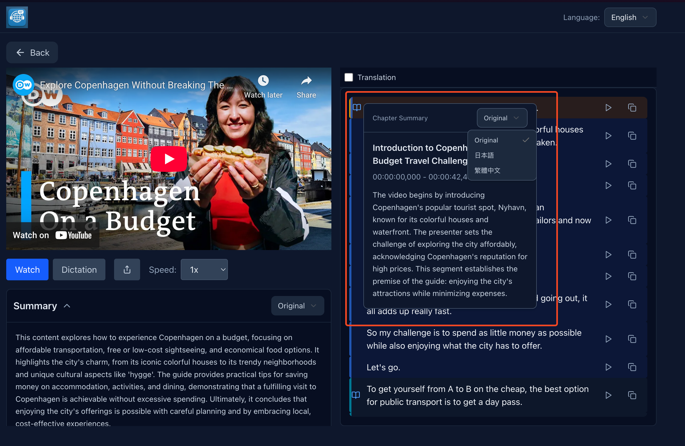
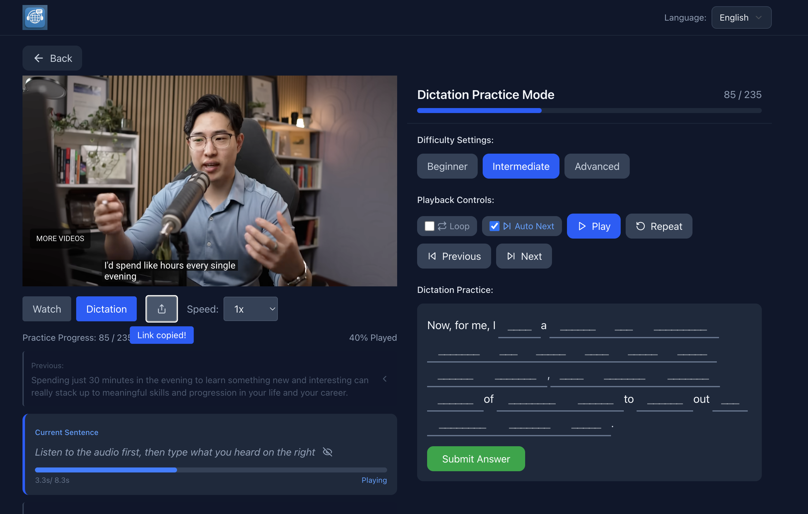

# LingoBitz

用 YouTube 影片練聽力的工具。看影片的時候覺得都聽懂了，實際要寫出來才發現根本不是那回事——這個專案就是要解決這個問題。

<p align="center">
  
</p>

[](https://nextjs.org)
[](https://reactjs.org)
[](https://www.typescriptlang.org)
[](https://tailwindcss.com)

📖 **[English Document](./README.md)**

---

## 主要功能

**聽打練習**
- 三種難度：初級給首字母提示、中級只給長度、高級完全自己打
- 切換難度時會記住你填過的內容，不用重打
- 打完馬上算準確率

**播放控制**
- 可以單句播放，播完自動停
- 循環播放模式，一句話重複聽到會為止

**字幕互動**
- 點字幕就跳到那個時間點
- 字幕會跟著影片自動捲動

**其他**
- 雙語對照（繁中、英文）
- AI 生成的影片摘要和章節重點
- 可以分享特定句子給朋友挑戰
- PWA 支援，可以裝到手機桌面

---

## 怎麼用

### 觀看模式
先看影片、看字幕、看摘要，搞懂內容在講什麼。點字幕可以跳轉，有翻譯可以對照。

<p align="center">
  
  
  
</p>

### 練習模式
切到練習模式開始聽打。三種難度隨你選：

<p align="center">
  
  
  
</p>

- 初級：`h____`（給首字母）
- 中級：`_____`（只給長度）
- 高級：整句自己打

### 分享挑戰
覺得某句話很難？分享給朋友一起練。

<p align="center">
  
</p>

---

## 其他截圖

影片列表：
<p align="center">
  
</p>

雙語對照：
<p align="center">
  
</p>

多語言介面：
<p align="center">
  
</p>

---

## 技術細節

想了解實作細節可以看這些文檔：
- [組件架構](./docs/DICTATION_COMPONENTS_DIAGRAM.md)
- [狀態管理討論](./docs/STATE_MACHINE_DISCUSSION.md)
- [聽打練習技術指南](./docs/BLANKS_FILL_PRACTICE_TECHNICAL_GUIDE.md)

技術棧：Next.js 15 (App Router)、React 19、Tailwind CSS v4、TanStack Query v5

測試用 Vitest + fast-check 做 property-based testing。

---

## 快速開始

```bash
git clone <repository-url>
npm install
npm run dev
# http://localhost:3500
```

---

## License
MIT License - Copyright (c) 2025 LingoBitz
