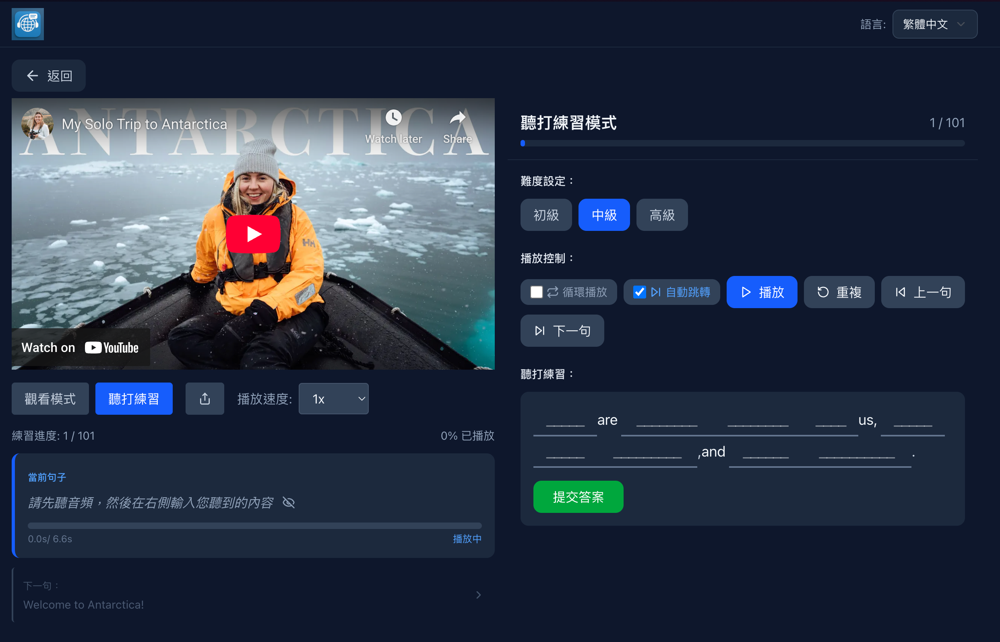
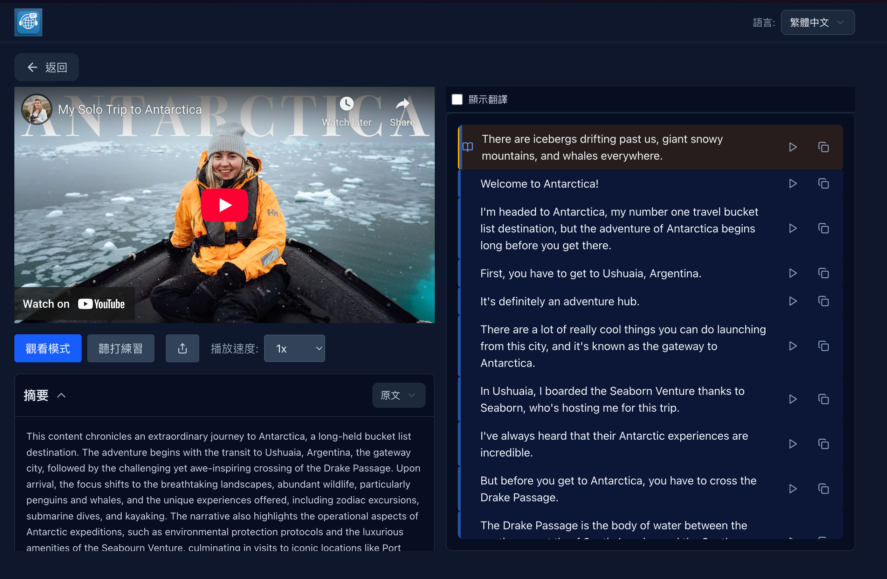
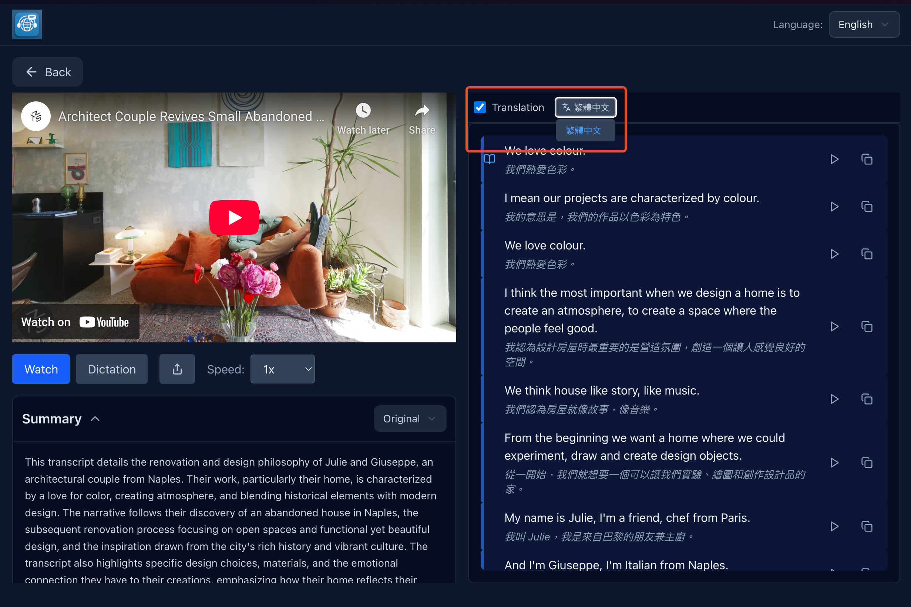
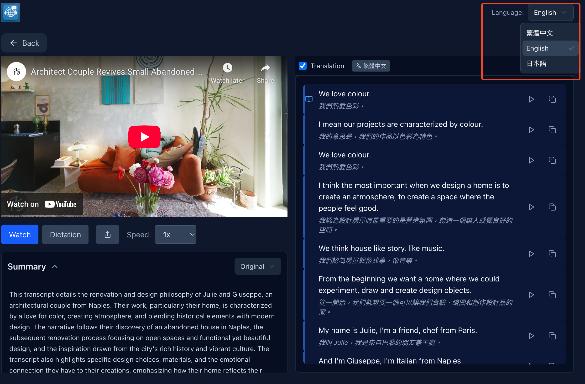
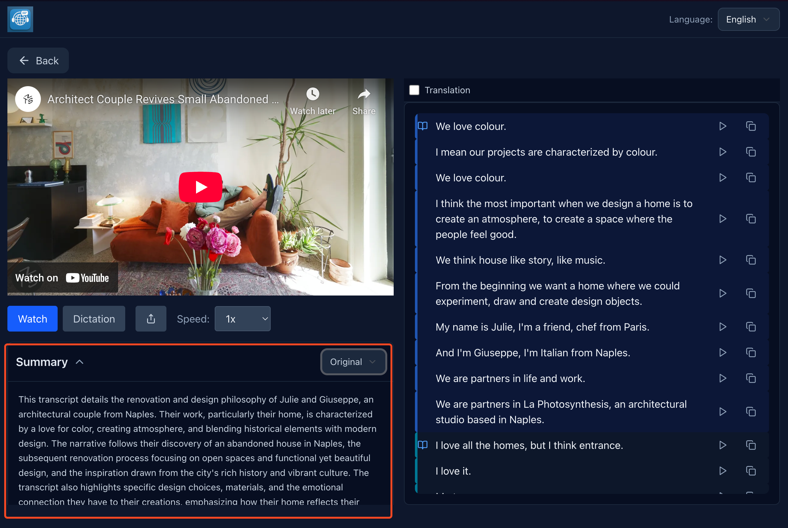
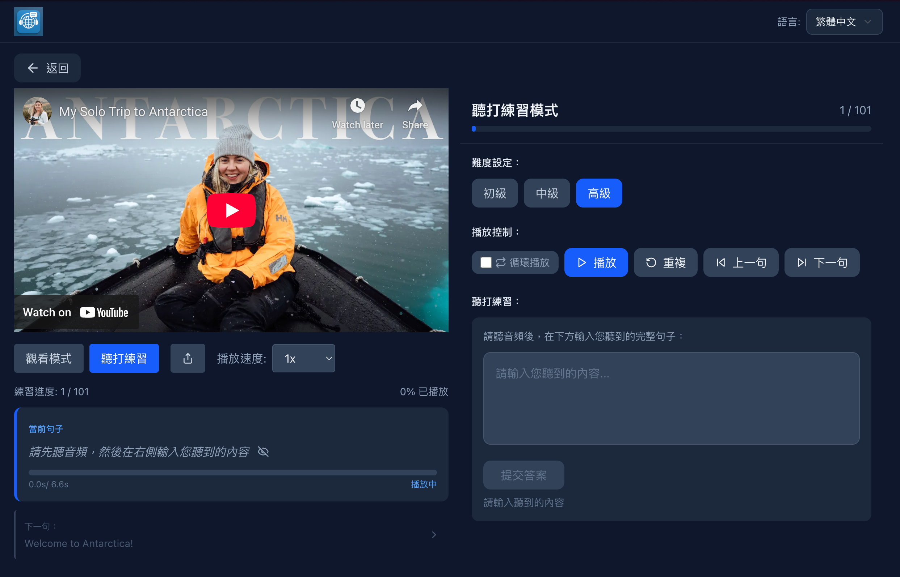

# 🎯 LingoBitz-Dictation-Pro

> **Modern language learning platform focused on interactive subtitles and intelligent dictation practice**

<p align="center">
  
</p>

A YouTube-based learning ecosystem built with Next.js 15, designed specifically for language learners. Features an innovative three-tier progressive dictation practice system and interactive subtitle functionality to provide professional-grade learning tools.

[](https://nextjs.org)
[](https://reactjs.org)
[](https://www.typescriptlang.org)
[](https://tailwindcss.com)

📖 **[中文文档](./README-zh.md)** | **[日本語](./README-ja.md)**

### 🖼️ Screenshots

| | |
|:---:|:---:|
| <br/>**Video List** | <br/>**Subtitle Viewer** |
| <br/>**Translation** | <br/>**Multi-language** |
| <br/>**Video Summary** | <br/>**Dictation (Advanced)** |

---

## ✨ Core Features

### 📝 **Three-Tier Progressive Dictation Practice**
Our innovative dictation practice system provides a complete learning path from beginner to advanced:

| Difficulty Level | Practice Method | Example | Target Users |
|-----------------|----------------|---------|--------------|
| **🟢 Beginner** | First letter hint fill-in-the-blank | `h____` (hello) | Build confidence for beginners |
| **🟡 Intermediate** | Length hint fill-in-the-blank | `_____` (hello) | Skill enhancement for intermediate learners |
| **🔴 Advanced** | Free-form sentence dictation | Complete sentence typing | Challenge for advanced users |

### 🧠 **Intelligent Memory System**
- **Cross-difficulty state preservation** - Switch between difficulty levels without losing progress
- **Stable ID mechanism** - Ensures consistency and reliability of practice states
- **Real-time progress sync** - Input states automatically saved, no worry about accidental loss

### 🎵 **Precise Playback Control**
- **Sentence-level precision** - Play sentence by sentence with millisecond accuracy
- **Loop playback mode** - Set key sentences to repeat automatically
- **Smart auto-pause** - Automatically pause at sentence end for practice
- **Timeline synchronization** - Perfect sync between subtitles and video

### 📖 **Interactive Subtitle Viewer**
- **Smart scrolling** - Current playing sentence automatically scrolls to optimal position
- **Click to jump** - Click any subtitle to jump to corresponding time
- **Highlight display** - Real-time highlighting of currently playing sentence
- **One-click copy** - Support quick copying of single sentence or entire segments
- **Translation support** - View subtitles in multiple languages simultaneously
- **Chapter navigation** - Jump between video sections with chapter summaries

### 📊 **AI-Generated Video Summaries**
- **Chapter-level summaries** - Detailed breakdown of video content by sections
- **Multi-language summaries** - Available in multiple languages for better comprehension
- **Interactive popover display** - Easy access to summary information while practicing
- **Overall and segment summaries** - Both high-level overview and detailed section analysis

### 📱 **Progressive Web App (PWA)**
- **Offline capability** - Continue learning even without internet connection
- **Screen wake lock** - Keeps screen awake during practice sessions
- **Mobile-optimized** - Responsive design with touch-friendly controls
- **App-like experience** - Install on device for native app feel

---

## 🚀 Quick Start

### Requirements
- **Node.js** >= 18.0.0
- **npm** >= 8.0.0 or **yarn** >= 1.22.0

### Installation

```bash
# Clone the repository
git clone <repository-url>
cd LingoBitz-Dictation-Pro

# Install dependencies
npm install

# Start development server
npm run dev
```

### Access the Application
After starting the development server, visit:
- **Local address**: [http://localhost:3500](http://localhost:3500)
- **Main feature**: The app will automatically redirect to the video list page

---

## 🛠️ Technology Stack

### Core Technologies
- **Frontend Framework**: Next.js 15 (App Router) + React 19
- **Programming Language**: TypeScript (strict mode)
- **Styling System**: Tailwind CSS v4 + Shadcn/ui (New York style)
- **Development Tools**: Turbopack (fast builds)
- **State Management**: TanStack Query v5 + React Hooks
- **Testing**: Vitest with property-based testing (fast-check)

### Backend Services & APIs
- **File Storage**: Cloudflare R2 / AWS S3
- **Video Processing**: Custom Worker API for metadata and SRT files
- **Internationalization**: next-intl multi-language support (zh-TW, en, ja)
- **Analytics**: Google Analytics with environment-based configuration

### Component Architecture
- **Functional Components**: 100% React Hooks architecture
- **State Management**: React state + useReducer pattern
- **Performance Optimization**: useCallback, useMemo, React.memo
- **Error Handling**: Complete error boundaries and user feedback

---

## 📁 Project Structure

```
├── app/                          # Next.js App Router
│   ├── api/                      # Backend API routes
│   │   ├── srt/[videoId]/       # SRT subtitle file service
│   │   ├── video/[videoId]/     # Video metadata APIs (languages, summary, segments)
│   │   ├── video-list/          # Video list management
│   │   └── thumbnail/[videoId]/ # Video thumbnail serving
│   ├── [locale]/                # Internationalized routes (zh-TW, en, ja)
│   │   ├── vp/[videoId]/       # 🎯 Video player & dictation practice pages
│   │   └── video-list/         # 📋 Video list management
│   └── layout.tsx, page.tsx     # Root layout and homepage
├── components/                   # React component library
│   ├── ui/                      # Shadcn/ui base components
│   ├── YouTubePlayer.tsx        # 🎥 YouTube IFrame API wrapper
│   ├── BlanksFillPractice.tsx   # 📝 Three-tier dictation practice component
│   ├── SrtTranscriptViewer.tsx  # 📖 Interactive subtitle viewer with translations
│   ├── VideoSummary.tsx         # 📊 AI-generated summary display
│   ├── SentenceDisplay.tsx      # Sentence information display
│   └── Header.tsx, LanguageSwitcher.tsx # Navigation components
├── lib/                         # Utilities & services
│   ├── srt-utils.ts            # SRT parsing & blanks generation algorithms
│   ├── video-service.ts        # Video data fetching with TanStack Query
│   ├── analytics.ts            # Google Analytics event tracking
│   ├── ga-config.ts            # Environment-based GA configuration
│   ├── types.ts                # Shared TypeScript interfaces
│   ├── utils.ts                # General utilities (cn, language names)
│   └── hooks/usePageTracking.ts # Page view tracking hook
├── messages/                    # Internationalization files
│   ├── en.json, ja.json, zh-TW.json # Translation files
│   └── ...
├── i18n/                        # next-intl configuration
│   ├── routing.ts              # Locale routing setup
│   └── request.ts              # Server-side i18n
├── __tests__/                   # Test files
│   ├── baseline-functionality.test.ts      # Core feature tests
│   └── transcription-removal-properties.test.ts # Property-based tests
└── docs/                        # 📚 Technical documentation
    ├── BLANKS_FILL_PRACTICE_TECHNICAL_GUIDE.md
    └── DICTATION_SYSTEM_ARCHITECTURE.md
```

---

## 🌐 API Endpoints

### Video Services
```typescript
GET /api/srt/[videoId]?lang=zh
// Get SRT subtitle file for specified video with optional language

GET /api/video/[videoId]/languages
// Get available language list for video

GET /api/video/[videoId]/summary?lang=zh
// Get AI-generated video summary with optional language

GET /api/video/[videoId]/segments?lang=zh
// Get video segments and chapter information

GET /api/video-list
// Get complete list of available learning videos

GET /api/thumbnail/[videoId]
// Get video thumbnail image
```

---

## 🎯 Usage Guide

### 1. Select Learning Video
1. Visit homepage and enter video list
2. Browse available learning videos
3. Select a video of interest to start learning

### 2. Dictation Practice
1. Enter video page and select practice mode
2. Choose practice difficulty: Beginner → Intermediate → Advanced
3. Use playback controls for sentence-by-sentence practice
4. View real-time feedback and accuracy scores

### 3. Subtitle Viewing
1. Browse complete subtitles in watch mode
2. Click any sentence to jump to playback time
3. Use one-click copy feature to organize study notes

---

## 🔧 Development Guide

### Development Commands
```bash
# Development mode (Turbopack)
npm run dev

# Production build
npm run build

# Start production server
npm start

# Code linting
npm run lint

# Run tests
npm test
```

### Key Design Patterns

#### State Management
```typescript
// State management using React Hooks
const [practiceState, setPracticeState] = useState<PracticeState>({
  difficulty: BlanksDifficulty.INTERMEDIATE,
  userInput: '',
  accuracy: 0,
  isComplete: false
});
```

#### Memory System
```typescript
// Cross-difficulty state preservation
interface DifficultyMemory {
  blanksInputs: Map<string, string>;
  practiceState: PracticeState;
}
```

#### Playback Control
```typescript
// Precise playback state management
const [isPlaying, setIsPlaying] = useState(false);
const [isLooping, setIsLooping] = useState(false);
const [currentTime, setCurrentTime] = useState(0);
```

---

## 🚢 Deployment Guide

### Environment Variables
```env
# Worker API Configuration
WORKER_URL=your_worker_api_url

# Application Configuration
NEXT_PUBLIC_SITE_URL=your_site_url
NEXT_PUBLIC_APP_ENV=development

# Google Analytics Configuration
NEXT_PUBLIC_GA_ENABLED=true
NEXT_PUBLIC_GA_MEASUREMENT_ID_DEV=your_dev_ga_id
NEXT_PUBLIC_GA_MEASUREMENT_ID_PROD=your_prod_ga_id
```

### Build and Deploy
```bash
# Production build
npm run build

# Start production server
npm start
```

### Vercel Deployment
The easiest way to deploy is using the [Vercel Platform](https://vercel.com/new?utm_medium=default-template&filter=next.js&utm_source=create-next-app&utm_campaign=create-next-app-readme):

1. Connect your GitHub repository
2. Configure environment variables
3. One-click deployment

---

## 📚 Technical Documentation

For detailed technical documentation, please refer to the `docs/` directory:

- 📖 **[Dictation Practice Technical Guide](./docs/BLANKS_FILL_PRACTICE_TECHNICAL_GUIDE.md)** - Complete implementation details
- 🏗️ **[System Architecture Diagram](./docs/DICTATION_SYSTEM_ARCHITECTURE.md)** - Visual system architecture
- 🤖 **[State Machine Discussion](./docs/STATE_MACHINE_DISCUSSION.md)** - Playback control state management
- 🎨 **[Design Documentation](./docs/DICTATION_PRACTICE_DESIGN.md)** - UI/UX design specifications

---

## 🌟 Product Highlights

### Market Differentiation
Compared to other language learning tools on the market, our unique advantages:

| Feature | Our Product | Other Tools |
|---------|-------------|-------------|
| **Progressive Difficulty** | ✅ Three-tier system | ❌ |
| **Memory System** | ✅ Cross-difficulty preservation | ❌ |
| **YouTube Integration** | ✅ Native support | Partial support |
| **Real-time Feedback** | ✅ Instant validation | ✅ |

### Target Users
- 🎓 **Language Learners** - Complete learning path from beginner to advanced
- 👨‍💼 **Professionals** - Business English and professional vocabulary practice
- 🏫 **Educational Institutions** - Can be used for classroom teaching and assignments
- 📚 **Self-learners** - Personalized learning progress and content selection

---

## 🧪 Testing

### Running Tests
```bash
# Run all tests
npm test

# Run tests in watch mode
npm run test

# Run tests once
npm run test:run

# Run tests with UI
npm run test:ui
```

### Code Standards
- Use **TypeScript** strict mode
- Follow **ESLint** configuration rules
- Components use **functional programming** patterns
- Commit messages use **conventional commit format**

---

## 📄 License

This project is licensed under the **MIT License** - see the [LICENSE](LICENSE) file for details.

---

## 🧪 Testing