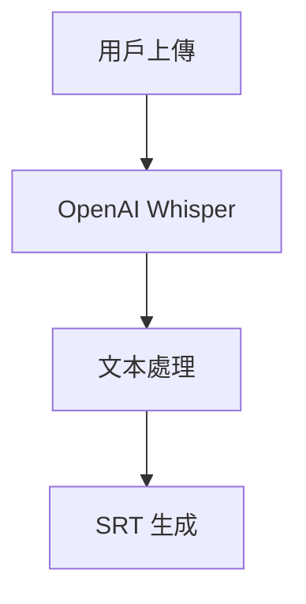

# 🎯 YouTube 智能學習平台

> **集轉錄、字幕查看與智能聽打練習於一體的現代化語言學習平台**

一個基於 Next.js 15 構建的 YouTube 視頻學習生態系統，提供從視頻轉錄到語言學習的完整解決方案。通過 AI 驅動的轉錄技術和獨創的三層漸進式聽打練習系統，為語言學習者提供專業級的學習工具。

[](https://nextjs.org)
[](https://reactjs.org)
[](https://www.typescriptlang.org)
[](https://tailwindcss.com)

---

## ✨ 核心功能特色

### 🎥 **智能轉錄系統**
- **YouTube 視頻轉錄** - 支援任意 YouTube 影片自動生成逐字稿
- **音頻文件轉錄** - 支援多種音頻格式上傳轉錄
- **實時進度追蹤** - Socket.io 驅動的轉錄進度即時更新
- **SRT 字幕導出** - 自動生成標準 SRT 字幕文件

### 📝 **三層漸進式聽打練習**
我們的獨創聽打練習系統，提供從初學者到高階的完整學習路徑：

| 難度級別 | 練習方式 | 示例展示 | 適用對象 |
|---------|----------|----------|----------|
| **🟢 初級** | 首字母提示填空 | `h____` (hello) | 初學者建立信心 |
| **🟡 中級** | 長度提示填空 | `_____` (hello) | 進階者技能提升 |
| **🔴 高級** | 完全自由輸入 | 整句聽寫 | 高階者挑戰自我 |

### 🧠 **智能記憶系統**
- **跨難度狀態保存** - 在不同難度間自由切換而不丟失進度
- **穩定ID機制** - 確保練習狀態的一致性和可靠性
- **即時進度同步** - 輸入狀態自動保存，無需擔心意外丟失

### 🎵 **精密播放控制**
- **句子級精確控制** - 逐句播放，精確到毫秒
- **循環播放模式** - 重點句子可設定自動重複
- **智能自動暫停** - 句子結束自動暫停等待練習
- **時間軸同步** - 字幕與視頻完美同步

### 📖 **互動字幕查看器**
- **智能滾動** - 當前播放句子自動滾動到最佳位置
- **點擊跳轉** - 點擊任意字幕即可跳轉到對應時間
- **高亮顯示** - 正在播放的句子實時高亮標示
- **一鍵複製** - 支援單句或整段字幕快速複製

---

## 🚀 快速開始

### 環境要求
- **Node.js** >= 18.0.0
- **npm** >= 8.0.0 或 **yarn** >= 1.22.0

### 安裝步驟

```bash
# 克隆專案
git clone <repository-url>
cd transcribe-translate-split

# 安裝依賴
npm install

# 啟動開發伺服器
npm run dev
```

### 訪問應用
開發伺服器啟動後，在瀏覽器中訪問：
- **本地地址**: [http://localhost:3500](http://localhost:3500)
- **主要功能**: 應用將自動重定向到轉錄功能頁面

---

## 🛠️ 技術架構

### 核心技術棧
- **前端框架**: Next.js 15 (App Router) + React 19
- **開發語言**: TypeScript (嚴格模式)
- **樣式系統**: Tailwind CSS v4 + Shadcn/ui (New York 風格)
- **開發工具**: Turbopack (快速建構)

### AI 與後端服務
- **語音轉錄**: OpenAI Whisper API
- **文本處理**: OpenAI GPT-4o-mini
- **實時通信**: Socket.io WebSocket
- **文件存儲**: Cloudflare R2 / AWS S3

### 組件架構
- **函數式組件**: 100% React Hooks 架構
- **狀態管理**: React state + useReducer 模式
- **性能優化**: useCallback, useMemo, React.memo
- **錯誤處理**: 完整的錯誤邊界和用戶反饋

---

## 📁 專案結構

```
├── app/                          # Next.js App Router
│   ├── api/                      # 後端 API 路由
│   │   ├── openai/              # OpenAI 服務集成
│   │   ├── srt/[videoId]/       # SRT 字幕文件服務
│   │   └── sentence-split/      # AI 文本分段服務
│   ├── videotranscript/         # 📽️ 轉錄功能主頁面
│   │   ├── youtube-client.tsx   # YouTube 轉錄客戶端
│   │   └── audio-client.tsx     # 音頻文件轉錄客戶端
│   ├── vp/[videoId]/           # 🎯 聽打練習頁面
│   └── video-list/             # 📋 視頻列表管理
├── components/                   # React 組件庫
│   ├── ui/                      # Shadcn/ui 基礎組件
│   ├── YouTubePlayer.tsx        # 🎥 YouTube 播放器核心
│   ├── BlanksFillPractice.tsx   # 📝 填空練習組件
│   ├── DictationPractice.tsx    # ✍️ 聽寫練習組件
│   └── SrtTranscriptViewer.tsx  # 📖 字幕查看器
├── lib/                         # 工具庫與服務
│   ├── srt-utils.ts            # SRT 文件處理工具
│   ├── socketManager.ts        # WebSocket 連接管理
│   ├── r2-service.ts           # Cloudflare R2 存儲服務
│   └── utils.ts                # 通用工具函數
└── docs/                        # 📚 技術文檔
    ├── BLANKS_FILL_PRACTICE_TECHNICAL_GUIDE.md
    ├── DICTATION_SYSTEM_ARCHITECTURE.md
    └── STATE_MACHINE_DISCUSSION.md
```

---

## 🌐 API 端點

### 轉錄服務
```typescript
POST /api/openai
// OpenAI 語音轉錄和文本處理

GET /api/srt/[videoId]
// 獲取指定視頻的 SRT 字幕文件

POST /api/sentence-split
// AI 驅動的智能文本分段
```

### 數據流向


---

## 🎯 使用指南

### 1. 轉錄逐字稿
1. 訪問主頁，自動進入轉錄功能
2. 選擇 **YouTube 轉錄** 或 **音頻文件轉錄**
3. 輸入 YouTube URL 或上傳音頻文件
4. 等待 AI 轉錄完成，下載 SRT 文件

### 2. 聽打練習
1. 轉錄完成後，進入聽打練習模式
2. 選擇練習難度：初級 → 中級 → 高級
3. 使用播放控制進行逐句練習
4. 查看即時反饋和準確度評分

### 3. 字幕查看
1. 在觀看模式下瀏覽完整字幕
2. 點擊任意句子跳轉播放時間
3. 使用一鍵複製功能整理學習筆記

---

## 🔧 開發指南

### 開發命令
```bash
# 開發模式 (Turbopack)
npm run dev

# 生產建構
npm run build

# 啟動生產伺服器
npm start

# 代碼檢查
npm run lint
```

### 關鍵設計模式

#### 狀態管理
```typescript
// 使用 React Hooks 進行狀態管理
const [practiceState, setPracticeState] = useState<PracticeState>({
  difficulty: BlanksDifficulty.INTERMEDIATE,
  userInput: '',
  accuracy: 0,
  isComplete: false
});
```

#### 記憶系統
```typescript
// 跨難度狀態保存
interface DifficultyMemory {
  blanksInputs: Map<string, string>;
  practiceState: PracticeState;
}
```

#### 播放控制
```typescript
// 精密的播放狀態管理
const [isPlaying, setIsPlaying] = useState(false);
const [isLooping, setIsLooping] = useState(false);
const [currentTime, setCurrentTime] = useState(0);
```

---

## 🚢 部署指南

### 環境變數配置
```env
# OpenAI API 配置
OPENAI_API_KEY=your_openai_api_key

# Cloudflare R2 配置
R2_ACCESS_KEY_ID=your_r2_access_key
R2_SECRET_ACCESS_KEY=your_r2_secret_key
R2_BUCKET_NAME=your_bucket_name

# Workers 服務 URL
WORKER_URL=your_cloudflare_worker_url
```

### 建構部署
```bash
# 生產建構
npm run build

# 啟動生產伺服器
npm start
```

### Vercel 部署
最簡單的部署方式是使用 [Vercel 平台](https://vercel.com/new?utm_medium=default-template&filter=next.js&utm_source=create-next-app&utm_campaign=create-next-app-readme)：

1. 連接您的 GitHub 倉庫
2. 配置環境變數
3. 一鍵部署完成

---

## 📚 技術文檔

詳細的技術文檔請參考 `docs/` 目錄：

- 📖 **[聽打練習技術指南](./docs/BLANKS_FILL_PRACTICE_TECHNICAL_GUIDE.md)** - 完整的功能實作細節
- 🏗️ **[系統架構圖](./docs/DICTATION_SYSTEM_ARCHITECTURE.md)** - 視覺化系統架構
- 🤖 **[狀態機討論](./docs/STATE_MACHINE_DISCUSSION.md)** - 播放控制狀態管理
- 🎨 **[設計文檔](./docs/DICTATION_PRACTICE_DESIGN.md)** - UI/UX 設計規範

---

## 🌟 產品亮點

### 市場差異化優勢
與市面上其他聽打工具相比，我們的獨特優勢：

| 特色功能 | 我們的產品 | Udict | Language Learning Ext | LyricsTraining |
|---------|----------|-------|----------------------|---------------|
| **漸進式難度** | ✅ 三層系統 | ❌ | ❌ | ❌ |
| **記憶系統** | ✅ 跨難度保存 | ❌ | ❌ | ❌ |
| **完整轉錄** | ✅ AI 驅動 | ❌ | ❌ | ❌ |
| **實時反饋** | ✅ 即時驗證 | ✅ | ✅ | ✅ |

### 目標用戶
- 🎓 **語言學習者** - 從初學到高階的完整學習路徑
- 👨‍💼 **職場人士** - 商務英語和專業詞彙練習
- 🏫 **教育機構** - 可用於課堂教學和作業布置
- 📚 **自學愛好者** - 個性化學習進度和內容選擇

---
### 代碼規範
- 使用 **TypeScript** 嚴格模式
- 遵循 **ESLint** 配置規則
- 組件採用 **函數式編程** 模式
- 提交信息使用 **常規提交格式**

---

## 📄 授權

本專案採用 **MIT 授權條款** - 詳見 [LICENSE](LICENSE) 文件。

---

## 📞 聯繫與支持

- 📧 **問題回報** - [GitHub Issues](https://github.com/your-repo/issues)
- 💬 **功能建議** - [GitHub Discussions](https://github.com/your-repo/discussions)
- 📖 **使用說明** - 查看 `docs/` 目錄詳細文檔

---

<div align="center">

**🎯 打造智能化語言學習新體驗**

*讓每一次聽打練習都更加精確、有效、有趣*

[](https://github.com/your-repo)
[](https://github.com/your-repo/fork)

</div>