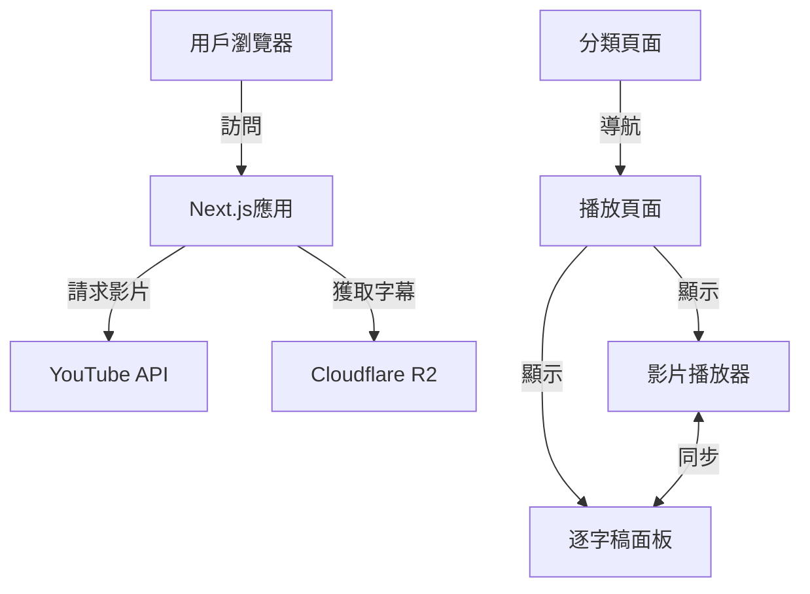

# 系統概述

## 1. 專案簡介

本系統是一個基於Next.js開發的YouTube影片學習平台，主要功能是將YouTube影片與其對應的逐字稿整合在一起，提供互動式的學習體驗。系統特點是實現了影片播放與逐字稿的雙向即時互動，並支持多種主題分類瀏覽。

### 目標用戶
- 語言學習者
- 教育工作者
- 研究人員
- 內容創作者

### 使用場景
- 語言學習與練習
- 影片內容研究與分析
- 教育課程輔助工具
- 內容製作參考

## 2. 核心功能

### 2.1 影片播放與互動
- YouTube影片嵌入與播放控制
- 自動跟蹤播放進度
- 支持時間點跳轉

### 2.2 逐字稿功能
- SRT格式逐字稿顯示
- 播放位置自動同步高亮
- 點擊文字跳轉影片
- 多語言翻譯顯示

### 2.3 分類導航
- 科技主題
- 旅遊主題
- 自我成長主題
- 創業主題

### 2.4 存儲集成
- Cloudflare R2存儲服務集成
- SRT文件管理
- 翻譯文本管理

## 3. 技術架構

### 3.1 前端技術
- **框架**: Next.js 14
- **程式語言**: TypeScript
- **樣式框架**: Tailwind CSS
- **狀態管理**: React Hooks

### 3.2 核心依賴
```json
{
  "dependencies": {
    "next": "^14.0.0",
    "react": "^18.0.0",
    "react-dom": "^18.0.0",
    "tailwindcss": "^3.0.0",
    "typescript": "^5.0.0"
  }
}
```

### 3.3 開發工具
- Visual Studio Code
- Git版本控制
- ESLint程式碼檢查
- Prettier程式碼格式化

### 3.4 系統架構圖



## 4. 系統特點

### 4.1 響應式設計
- 適配桌面端與移動端
- 流暢的布局切換
- 觸控友好的交互

### 4.2 性能優化
- 靜態生成與服務端渲染結合
- 資源懶加載
- 緩存策略優化

### 4.3 可擴展性
- 模塊化的組件設計
- 可插拔的功能架構
- 支持未來功能擴展

## 5. 使用限制

### 5.1 瀏覽器支持
- Chrome (最新3個版本)
- Firefox (最新3個版本)
- Safari (最新2個版本)
- Edge (最新3個版本)

### 5.2 性能要求
- 最低網絡速度：1Mbps
- 建議網絡速度：5Mbps以上
- 設備內存：最低4GB RAM

### 5.3 API限制
- YouTube API配額限制
- R2存儲容量限制
- 每日請求次數限制

## 6. 後續規劃

### 6.1 近期計劃
- 添加用戶註冊登錄功能
- 實現個人收藏功能
- 加入筆記功能

### 6.2 長期規劃
- AI輔助摘要生成
- 社區互動功能
- 移動端應用開發
