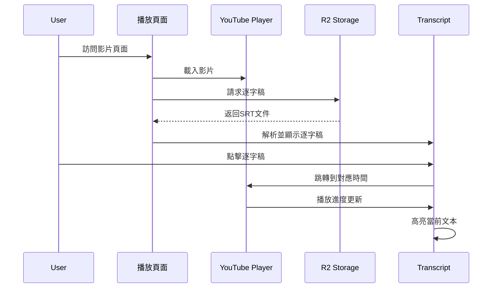
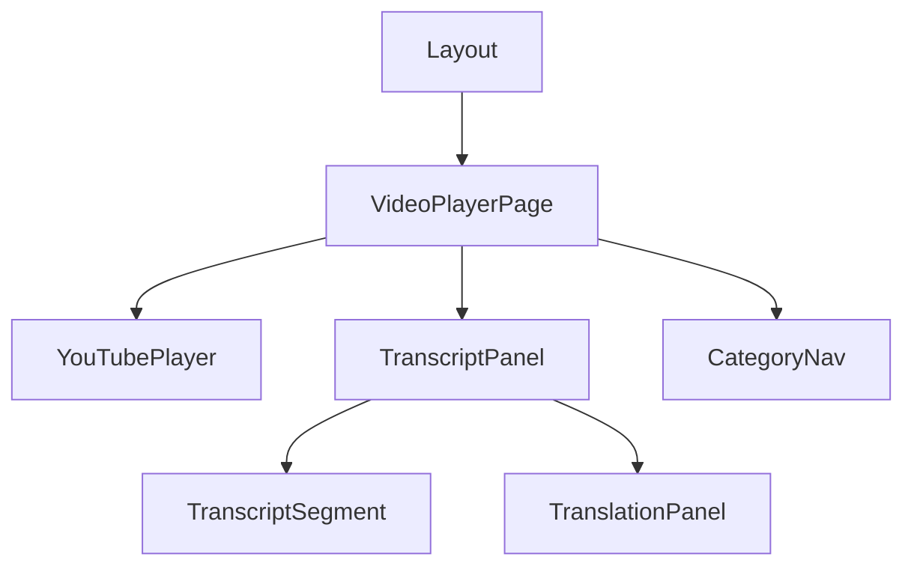

# 系統架構設計

## 1. 前端架構

### 1.1 目錄結構
```
/app
  /video-player
    /[videoId]
      /page.tsx       # 影片播放頁面
      /layout.tsx     # 播放頁面布局
  /video-list
    /page.tsx         # 分類導航主頁
    /[category]
      /page.tsx       # 分類列表頁
/components
  /VideoPlayer.tsx    # YouTube 播放器組件
  /Transcript.tsx     # 逐字稿顯示組件
  /CategoryNav.tsx    # 分類導航組件
/lib
  /r2-service.ts      # R2 存儲訪問服務
  /srt-parser.ts      # SRT 解析邏輯
  /utils.ts           # 工具函數
```

### 1.2 技術選型
- **路由系統**: Next.js App Router
- **頁面渲染**: Server Components + Client Components 混合架構
- **狀態管理**: React Context + Hooks
- **樣式方案**: Tailwind CSS + CSS Modules
- **API 請求**: Fetch API + Axios

## 2. 數據流設計

### 2.1 核心數據流


### 2.2 狀態管理
```typescript
interface PlayerState {
  isPlaying: boolean;
  currentTime: number;
  duration: number;
  volume: number;
}

interface TranscriptState {
  segments: SRTSegment[];
  activeSegmentId: number | null;
  isAutoScroll: boolean;
}

interface AppState {
  player: PlayerState;
  transcript: TranscriptState;
  settings: UserSettings;
}
```

## 3. 組件結構

### 3.1 組件層級關係


### 3.2 核心組件職責

#### VideoPlayerPage
- 頁面整體布局管理
- 播放器與逐字稿的狀態同步
- URL 參數處理
- R2 數據請求

#### YouTubePlayer
- YouTube IFrame API 整合
- 播放控制介面
- 播放狀態管理
- 時間更新事件

#### TranscriptPanel
- SRT 解析與顯示
- 段落導航
- 自動滾動控制
- 高亮邏輯

## 4. 接口設計

### 4.1 內部接口
```typescript
// YouTube 播放器組件接口
interface YouTubePlayerProps {
  videoId: string;
  onTimeUpdate: (time: number) => void;
  onStateChange: (state: PlayerState) => void;
}

// 逐字稿面板接口
interface TranscriptPanelProps {
  srtContent: string;
  currentTime: number;
  onSegmentClick: (time: number) => void;
}
```

### 4.2 外部接口
```typescript
// R2 存儲服務接口
interface R2Service {
  getSRT(videoId: string): Promise<string>;
  getTranslation(videoId: string, language: string): Promise<string>;
}

// YouTube API 接口
interface YouTubeAPI {
  loadVideo(videoId: string): void;
  play(): void;
  pause(): void;
  seekTo(time: number): void;
}
```

## 5. 用戶交互流程

### 5.1 主要交互流程
1. 用戶從分類頁面選擇影片
2. 系統載入影片和對應逐字稿
3. 用戶可以：
   - 播放/暫停影片
   - 點擊逐字稿跳轉
   - 切換翻譯顯示
   - 調整播放進度

### 5.2 錯誤處理流程
1. 影片載入失敗處理
2. 逐字稿獲取失敗處理
3. 網絡異常處理
4. API 限制處理

## 6. 性能考慮

### 6.1 首次加載優化
- 組件懶加載
- 資源預加載
- 靜態生成優化

### 6.2 運行時優化
- 虛擬滾動列表
- 防抖與節流
- 記憶化計算

### 6.3 緩存策略
- SWR 數據緩存
- 靜態資源緩存
- 瀏覽器存儲優化
