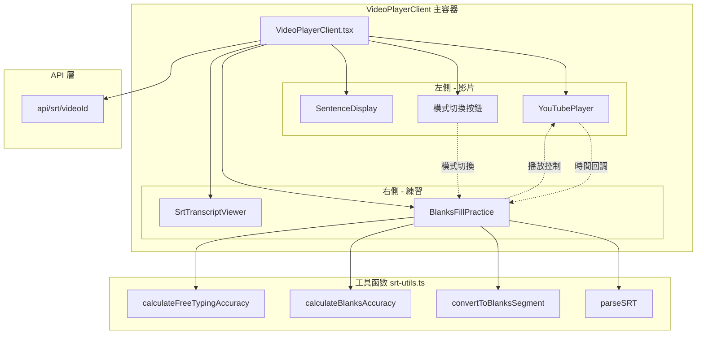
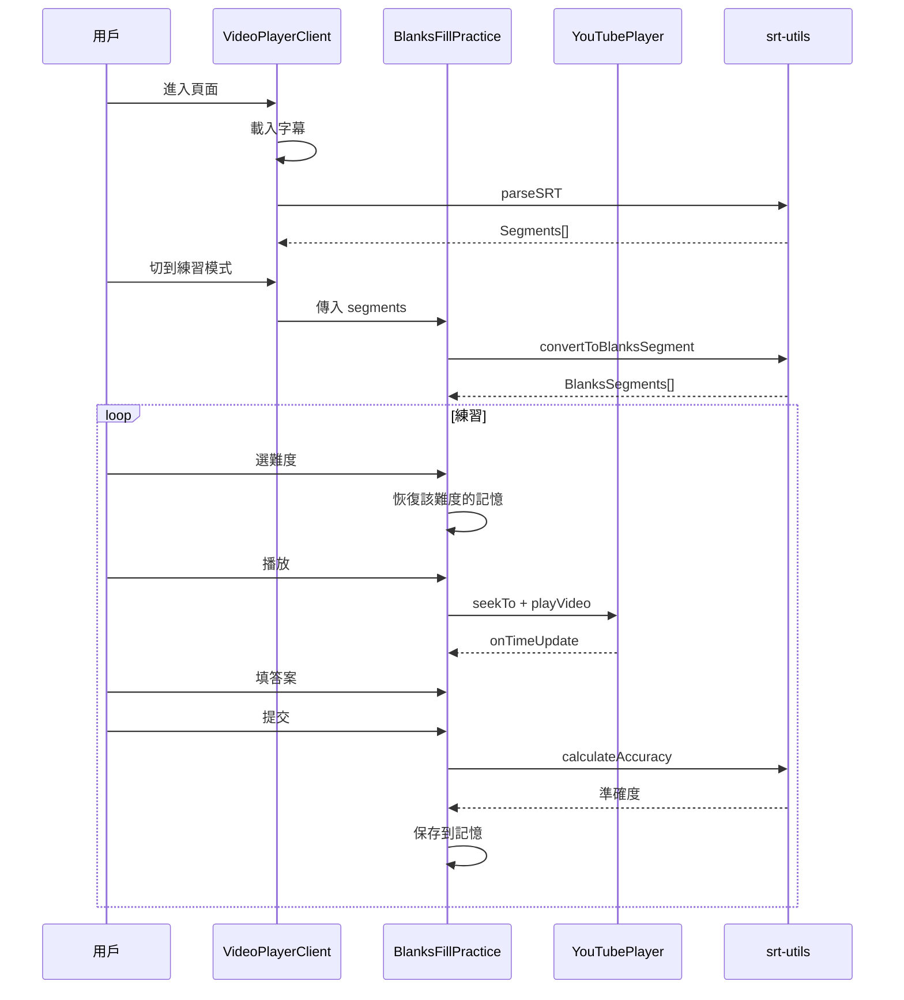
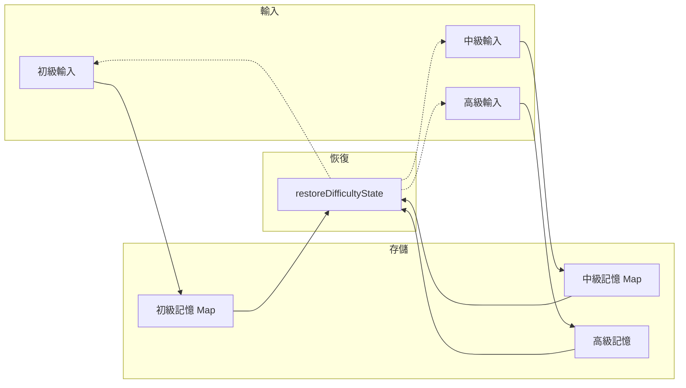

# 聽打功能組件架構

這份文檔說明聽打練習功能的組件結構和資料流。

## 整體架構



## BlanksFillPractice 內部結構

這是聽打練習的核心組件，負責：

**狀態管理**
- 練習狀態：用戶輸入、完成狀態、準確度、嘗試歷史
- 播放狀態：播放/暫停、循環模式、時間追蹤
- 記憶狀態：三種難度各自的輸入記錄

**三種難度**
- 初級：首字母提示（`h____`）
- 中級：長度提示（`_____`）
- 高級：自由輸入整句

**播放控制**
- 播放/暫停/重複
- 循環播放
- 上一句/下一句
- 自動暫停（播到句尾停下來）

## 資料流



## 記憶系統

切換難度時會保存當前輸入，切回來時恢復。

關鍵是 ID 的穩定性：用 `segmentId-wordIndex-cleanWord` 當 ID，這樣同一個單字在不同難度下 ID 一樣，才能正確恢復。



## 準確度計算

兩種算法：

**填空模式（初級/中級）**
```
準確度 = 正確空格數 / 總空格數 × 100%
```

**自由輸入（高級）**
```
1. 文字正規化（小寫、去標點、統一空格）
2. 切成單字陣列
3. 逐位置比對
4. 準確度 = 匹配數 / max(用戶詞數, 正確詞數) × 100%
```

## 播放狀態

用多個 boolean 組合表示狀態：

| 狀態 | isPlaying | isStarting | isLoopWaiting |
|------|-----------|------------|---------------|
| 閒置 | false | false | false |
| 啟動中 | false | true | false |
| 播放中 | true | false | false |
| 循環等待 | false | false | true |

這其實是個隱式的狀態機，詳細討論見 [STATE_MACHINE_DISCUSSION.md](./STATE_MACHINE_DISCUSSION.md)。
