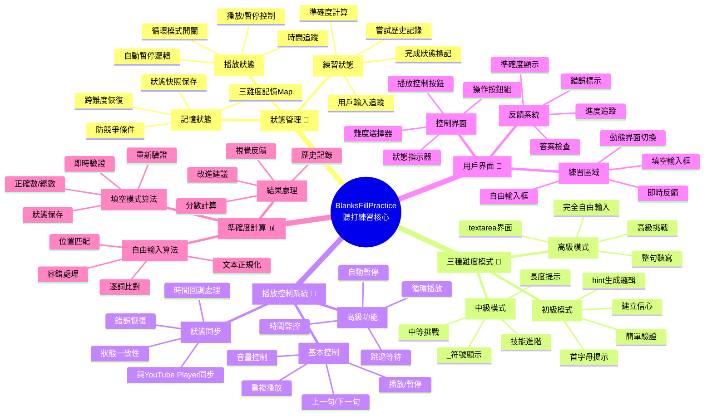
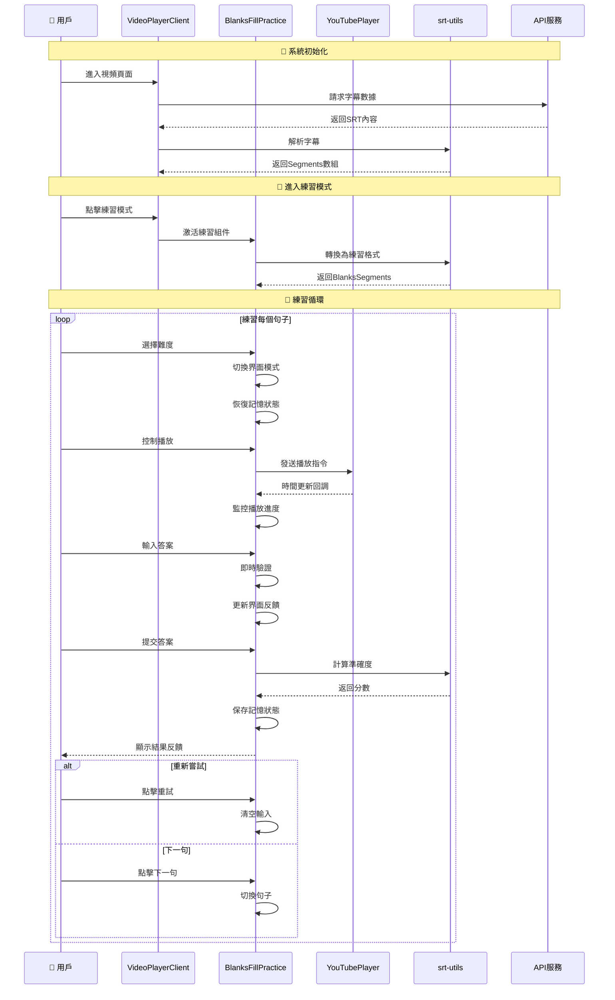
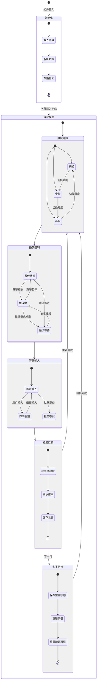
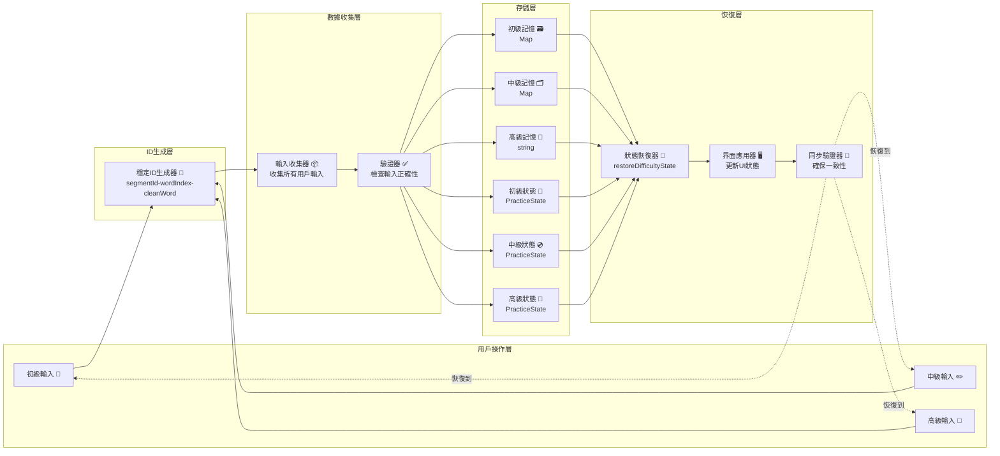
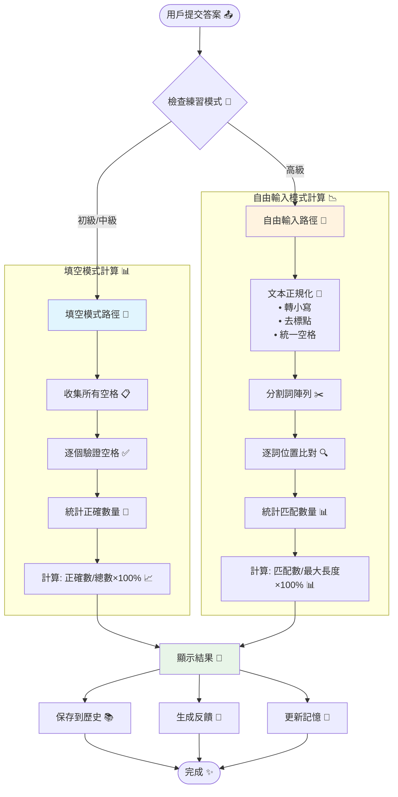
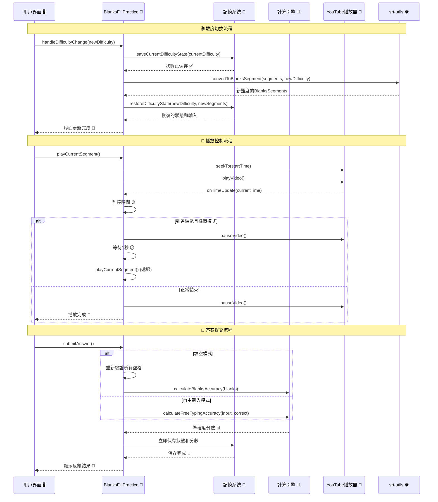

# 聽打功能組件和功能關係圖

## 整體架構圖

```mermaid
graph TB
    subgraph "主容器 - VideoPlayerClient"
        VPC[VideoPlayerClient.tsx<br/>🎯 主要協調器]
        
        subgraph "左側區域 - 視頻播放"
            YTP[YouTubePlayer.tsx<br/>🎥 視頻播放器]
            MODE[模式切換按鈕<br/>👆 觀看 ↔ 練習]
            SD[SentenceDisplay.tsx<br/>📱 句子顯示(桌面版)]
        end
        
        subgraph "右側區域 - 練習功能"
            BFP[BlanksFillPractice.tsx<br/>📝 主要練習組件]
            STV[SrtTranscriptViewer.tsx<br/>📜 字幕查看器]
        end
    end
    
    subgraph "工具層 - srt-utils.ts"
        PARSE[parseSRT 📄<br/>解析字幕文件]
        CONVERT[convertToBlanksSegment 🔄<br/>轉換為填空練習]
        CALC1[calculateBlanksAccuracy 📊<br/>填空準確度計算]
        CALC2[calculateFreeTypingAccuracy 📈<br/>自由輸入準確度計算]
    end
    
    subgraph "API 層"
        API[/api/srt/[videoId] 🌐<br/>字幕API]
        OPENAI[/api/openai 🤖<br/>AI處理API]
    end
    
    VPC --> YTP
    VPC --> MODE
    VPC --> SD
    VPC --> BFP
    VPC --> STV
    
    BFP --> PARSE
    BFP --> CONVERT
    BFP --> CALC1
    BFP --> CALC2
    
    VPC --> API
    API --> OPENAI
    
    YTP -.->|時間回調| BFP
    MODE -.->|模式切換| BFP
    BFP -.->|播放控制| YTP
```

## BlanksFillPractice 詳細功能分解



## 功能流程圖



## 狀態管理架構



## 記憶系統工作原理



## 準確度計算雙軌制



## 組件通信關係

```mermaid
graph TD
    subgraph "外部依賴 🔗"
        REACT[React Hooks 🪝]
        SHADCN[Shadcn/ui 🎨]
        LUCIDE[Lucide Icons 🎯]
    end
    
    subgraph "核心組件層 🏗️"
        VPC[VideoPlayerClient 🎬<br/>主協調器]
        BFP[BlanksFillPractice 📝<br/>練習核心]
        YTP[YouTubePlayer 🎥<br/>播放器]
        STV[SrtTranscriptViewer 📜<br/>字幕查看]
        SD[SentenceDisplay 📱<br/>句子顯示]
    end
    
    subgraph "工具函數層 🛠️"
        SU[srt-utils 📄<br/>字幕工具]
        CALC[計算函數 📊<br/>準確度算法]
        PARSE[解析函數 🔍<br/>SRT處理]
    end
    
    subgraph "數據層 💾"
        SEGMENTS[Segments[] 📋<br/>原始數據]
        BLANKS[BlanksSegments[] 📝<br/>練習數據]
        STATE[練習狀態 🧠<br/>用戶進度]
    end
    
    subgraph "API服務層 🌐"
        SRT_API[SRT API 📡<br/>字幕獲取]
        OPENAI_API[OpenAI API 🤖<br/>AI處理]
    end
    
    %% 依賴關係
    REACT --> BFP
    SHADCN --> BFP
    LUCIDE --> BFP
    
    %% 組件關係
    VPC --> BFP
    VPC --> YTP
    VPC --> STV
    VPC --> SD
    
    %% 雙向通信
    BFP <--> YTP
    BFP --> SU
    SU --> CALC
    SU --> PARSE
    
    %% 數據流
    SRT_API --> SEGMENTS
    SEGMENTS --> BLANKS
    BLANKS --> STATE
    
    %% API調用
    VPC --> SRT_API
    SU --> OPENAI_API
    
    %% 樣式定義
    classDef external fill:#f9f9f9,stroke:#999,stroke-width:2px
    classDef component fill:#e3f2fd,stroke:#1976d2,stroke-width:2px
    classDef utility fill:#f3e5f5,stroke:#7b1fa2,stroke-width:2px
    classDef data fill:#e8f5e8,stroke:#388e3c,stroke-width:2px
    classDef api fill:#fff3e0,stroke:#f57c00,stroke-width:2px
    
    class REACT,SHADCN,LUCIDE external
    class VPC,BFP,YTP,STV,SD component
    class SU,CALC,PARSE utility
    class SEGMENTS,BLANKS,STATE data
    class SRT_API,OPENAI_API api
```

## 關鍵函數調用鏈



## 總結 📋

這個聽打練習系統展現了現代 React 應用的以下特色：

### 🏗️ **模組化架構**
- 清晰的組件職責分離
- 可重用的工具函數
- 良好的抽象層次

### 🧠 **智能狀態管理**
- 跨難度記憶保存
- 防競爭條件設計
- 狀態一致性保證

### 🎯 **用戶體驗優化**
- 漸進式難度設計
- 即時反饋機制
- 流暢的交互體驗

### ⚡ **性能優化**
- useCallback 優化
- 條件渲染策略
- 資源清理機制

這個架構圖展示了聽打功能的完整生態系統，幫助開發者理解各組件間的關係和數據流向，為後續維護和功能擴展提供清晰的指導。