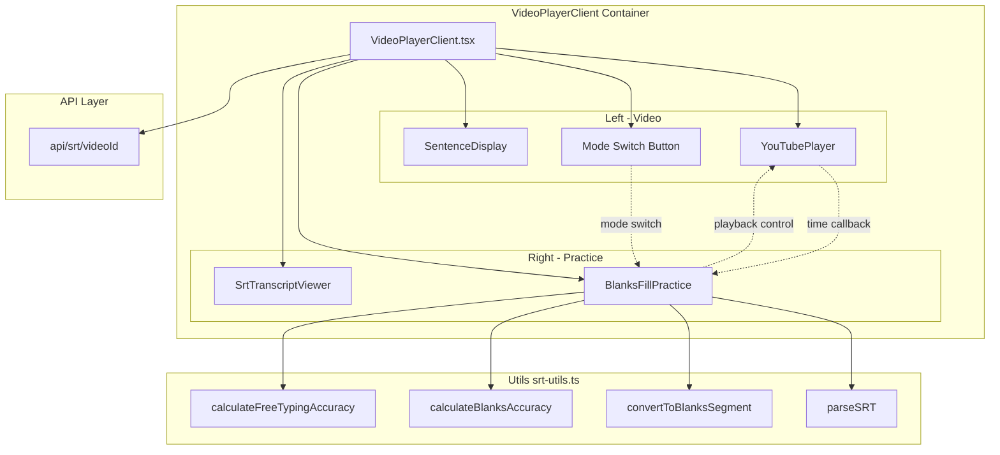
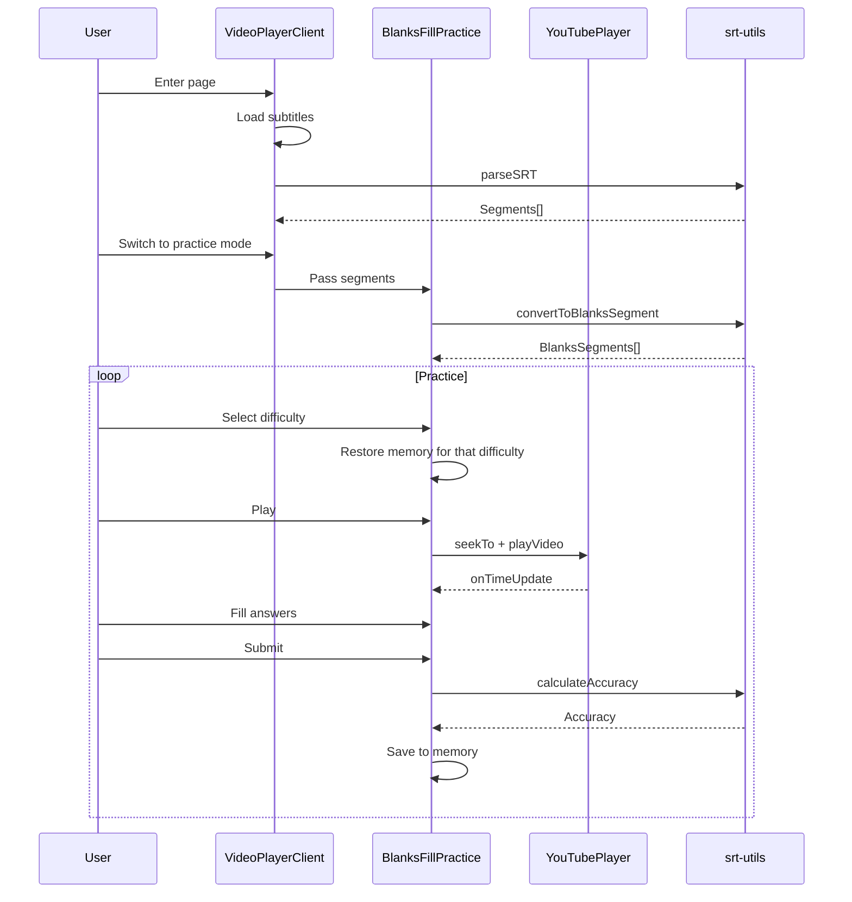
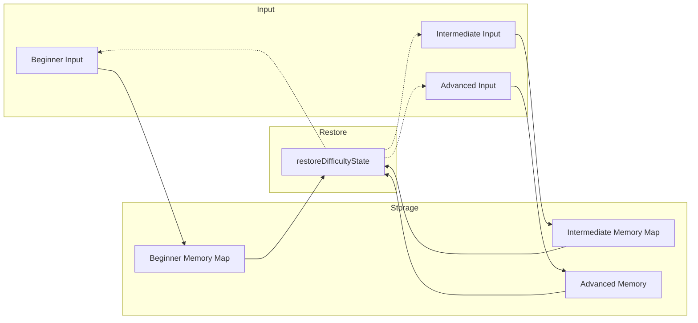

# Dictation Feature Component Architecture

This doc explains the component structure and data flow of the dictation practice feature.

## Overall Architecture



## BlanksFillPractice Internals

This is the core component for dictation practice. It handles:

**State Management**
- Practice state: user input, completion status, accuracy, attempt history
- Playback state: play/pause, loop mode, time tracking
- Memory state: input records for each difficulty level

**Three Difficulty Levels**
- Beginner: first letter hint (`h____`)
- Intermediate: length hint (`_____`)
- Advanced: free-form full sentence input

**Playback Control**
- Play/pause/repeat
- Loop playback
- Previous/next sentence
- Auto-pause at sentence end

## Data Flow



## Memory System

When switching difficulty, current input is saved and restored when switching back.

The key is stable IDs: we use `segmentId-wordIndex-cleanWord` as ID, so the same word has the same ID across difficulties, enabling correct restoration.



## Accuracy Calculation

Two algorithms:

**Blanks Mode (Beginner/Intermediate)**
```
Accuracy = correct blanks / total blanks * 100%
```

**Free Input (Advanced)**
```
1. Normalize text (lowercase, remove punctuation, normalize spaces)
2. Split into word arrays
3. Compare position by position
4. Accuracy = matches / max(user words, correct words) * 100%
```

## Playback State

Multiple booleans combined to represent state:

| State | isPlaying | isStarting | isLoopWaiting |
|-------|-----------|------------|---------------|
| Idle | false | false | false |
| Starting | false | true | false |
| Playing | true | false | false |
| Loop Waiting | false | false | true |

This is essentially an implicit state machine. See [STATE_MACHINE_DISCUSSION_EN.md](./STATE_MACHINE_DISCUSSION_EN.md) for details.
