# Dictation Feature Components and Relationships

## Overall Architecture Diagram

```mermaid
graph TB
    subgraph "Main Container - VideoPlayerClient"
        VPC[VideoPlayerClient.tsx<br/>🎯 Main Coordinator]
        
        subgraph "Left Area - Video Playback"
            YTP[YouTubePlayer.tsx<br/>🎥 Video Player]
            MODE[Mode Switch Button<br/>👆 Watch ↔ Practice]
            SD[SentenceDisplay.tsx<br/>📱 Sentence Display - Desktop]
        end
        
        subgraph "Right Area - Practice Features"
            BFP[BlanksFillPractice.tsx<br/>📝 Main Practice Component]
            STV[SrtTranscriptViewer.tsx<br/>📜 Transcript Viewer]
        end
    end
    
    subgraph "Utility Layer - srt-utils.ts"
        PARSE[parseSRT 📄<br/>Parse subtitle files]
        CONVERT[convertToBlanksSegment 🔄<br/>Convert to blanks practice]
        CALC1[calculateBlanksAccuracy 📊<br/>Blanks accuracy calculation]
        CALC2[calculateFreeTypingAccuracy 📈<br/>Free typing accuracy calculation]
    end
    
    subgraph "API Layer"
        API["/api/srt/videoId 🌐<br/>Subtitle API"]
        OPENAI["/api/openai 🤖<br/>AI Processing API"]
    end
    
    VPC --> YTP
    VPC --> MODE
    VPC --> SD
    VPC --> BFP
    VPC --> STV
    
    BFP --> PARSE
    BFP --> CONVERT
    BFP --> CALC1
    BFP --> CALC2
    
    VPC --> API
    API --> OPENAI
    
    YTP -.->|Time callback| BFP
    MODE -.->|Mode switch| BFP
    BFP -.->|Playback control| YTP
```

## BlanksFillPractice Detailed Feature Breakdown

```mermaid
mindmap
  root((BlanksFillPractice<br/>Dictation Core))
    [State Management 🧠]
      [Practice State]
        User input tracking
        Completion status
        Accuracy calculation
        Attempt history
      [Playback State]
        Play/pause control
        Loop mode toggle
        Time tracking
        Auto-pause logic
      [Memory State]
        Three difficulty memory maps
        State snapshot saving
        Cross-difficulty restore
        Race condition prevention
    
    [Three Difficulty Modes 🎯]
      [Beginner Mode]
        First-letter hints
        Hint generation logic
        Simple validation
        Build confidence
      [Intermediate Mode]
        Length hints
        Underscore display
        Medium challenge
        Skill advancement
      [Advanced Mode]
        Complete free input
        Textarea interface
        Full sentence dictation
        Advanced challenge
    
    [Playback Control System 🎵]
      [Basic Controls]
        Play/pause
        Repeat playback
        Previous/next sentence
        Volume control
      [Advanced Features]
        Loop playback
        Auto-pause
        Skip waiting
        Time monitoring
      [State Sync]
        Sync with YouTube Player
        Time callback handling
        State consistency
        Error recovery
    
    [User Interface 🎨]
      [Practice Area]
        Dynamic interface switching
        Blanks input fields
        Free input field
        Real-time feedback
      [Feedback System]
        Accuracy display
        Error highlighting
        Answer checking
        Progress tracking
      [Control Interface]
        Difficulty selector
        Playback control buttons
        Action button groups
        Status indicators
    
    [Accuracy Calculation 📊]
      [Blanks Mode Algorithm]
        Correct count / total
        Real-time validation
        Re-validation
        State saving
      [Free Input Algorithm]
        Text normalization
        Word-by-word comparison
        Position matching
        Error tolerance
      [Result Processing]
        Score calculation
        History recording
        Visual feedback
        Improvement suggestions
```

## Feature Flow Diagram

## State Management Architecture

## Memory System Working Principle

```mermaid
graph LR
    subgraph "User Operation Layer"
        I1[Beginner Input 📝]
        I2[Intermediate Input ✏️]
        I3[Advanced Input 📄]
    end
    
    subgraph "ID Generation Layer"
        GEN[Stable ID Generator 🔑<br/>segmentId-wordIndex-cleanWord]
    end
    
    subgraph "Data Collection Layer"
        COL[Input Collector 📦<br/>Collect all user inputs]
        VAL[Validator ✅<br/>Check input correctness]
    end
    
    subgraph "Storage Layer"
        M1["Beginner Memory 🗃️<br/>Map&lt;string, string&gt;"]
        M2["Intermediate Memory 🗂️<br/>Map&lt;string, string&gt;"]
        M3[Advanced Memory 📁<br/>string]
        S1[Beginner State 💾<br/>PracticeState]
        S2[Intermediate State 💿<br/>PracticeState]
        S3[Advanced State 💽<br/>PracticeState]
    end
    
    subgraph "Restore Layer"
        REST[State Restorer 🔄<br/>restoreDifficultyState]
        APPLY[UI Applier 🖥️<br/>Update UI state]
        SYNC[Sync Validator 🔗<br/>Ensure consistency]
    end
    
    I1 --> GEN
    I2 --> GEN
    I3 --> GEN
    
    GEN --> COL
    COL --> VAL
    
    VAL --> M1
    VAL --> M2
    VAL --> M3
    VAL --> S1
    VAL --> S2
    VAL --> S3
    
    M1 --> REST
    M2 --> REST
    M3 --> REST
    S1 --> REST
    S2 --> REST
    S3 --> REST
    
    REST --> APPLY
    APPLY --> SYNC
    
    SYNC -.->|Restore to| I1
    SYNC -.->|Restore to| I2
    SYNC -.->|Restore to| I3
```

## Accuracy Calculation Dual-Track System

```mermaid
flowchart TD
    START([User submits answer 📤]) --> MODE{Check practice mode 🎯}
    
    MODE -->|Beginner/Intermediate| BLANK_PATH[Blanks mode path 📝]
    MODE -->|Advanced| FREE_PATH[Free input path 📄]
    
    subgraph "Blanks Mode Calculation 📊"
        BLANK_PATH --> COLLECT[Collect all blanks 📋]
        COLLECT --> VERIFY[Validate each blank ✅]
        VERIFY --> COUNT_BLANK[Count correct answers 🔢]
        COUNT_BLANK --> CALC_BLANK[Calculate: correct/total×100% 📈]
    end
    
    subgraph "Free Input Mode Calculation 📉"
        FREE_PATH --> NORMALIZE[Text normalization 🧹<br/>• Lowercase<br/>• Remove punctuation<br/>• Normalize spaces]
        NORMALIZE --> SPLIT[Split into word array ✂️]
        SPLIT --> COMPARE[Word-by-word position comparison 🔍]
        COMPARE --> COUNT_FREE[Count matches 📊]
        COUNT_FREE --> CALC_FREE[Calculate: matches/max_length×100% 📊]
    end
    
    CALC_BLANK --> RESULT[Display result 🎉]
    CALC_FREE --> RESULT
    
    RESULT --> HISTORY[Save to history 📚]
    RESULT --> FEEDBACK[Generate feedback 💬]
    RESULT --> MEMORY[Update memory 🧠]
    
    HISTORY --> END([Complete ✨])
    FEEDBACK --> END
    MEMORY --> END
    
    style BLANK_PATH fill:#e1f5fe
    style FREE_PATH fill:#fff3e0
    style RESULT fill:#e8f5e8
```

## Component Communication Relationships

```mermaid
graph TD
    subgraph "External Dependencies 🔗"
        REACT[React Hooks 🪝]
        SHADCN[Shadcn/ui 🎨]
        LUCIDE[Lucide Icons 🎯]
    end
    
    subgraph "Core Component Layer 🏗️"
        VPC[VideoPlayerClient 🎬<br/>Main coordinator]
        BFP[BlanksFillPractice 📝<br/>Practice core]
        YTP[YouTubePlayer 🎥<br/>Player]
        STV[SrtTranscriptViewer 📜<br/>Transcript viewer]
        SD[SentenceDisplay 📱<br/>Sentence display]
    end
    
    subgraph "Utility Function Layer 🛠️"
        SU[srt-utils 📄<br/>Subtitle utilities]
        CALC[Calculation functions 📊<br/>Accuracy algorithms]
        PARSE[Parser functions 🔍<br/>SRT processing]
    end
    
    subgraph "Data Layer 💾"
        SEGMENTS["Segments[] 📋<br/>Raw data"]
        BLANKS["BlanksSegments[] 📝<br/>Practice data"]
        STATE[Practice state 🧠<br/>User progress]
    end
    
    subgraph "API Service Layer 🌐"
        SRT_API[SRT API 📡<br/>Subtitle fetching]
        OPENAI_API[OpenAI API 🤖<br/>AI processing]
    end
    
    %% Dependency relationships
    REACT --> BFP
    SHADCN --> BFP
    LUCIDE --> BFP
    
    %% Component relationships
    VPC --> BFP
    VPC --> YTP
    VPC --> STV
    VPC --> SD
    
    %% Bidirectional communication
    BFP <--> YTP
    BFP --> SU
    SU --> CALC
    SU --> PARSE
    
    %% Data flow
    SRT_API --> SEGMENTS
    SEGMENTS --> BLANKS
    BLANKS --> STATE
    
    %% API calls
    VPC --> SRT_API
    SU --> OPENAI_API
    
    %% Style definitions
    classDef external fill:#f9f9f9,stroke:#999,stroke-width:2px
    classDef component fill:#e3f2fd,stroke:#1976d2,stroke-width:2px
    classDef utility fill:#f3e5f5,stroke:#7b1fa2,stroke-width:2px
    classDef data fill:#e8f5e8,stroke:#388e3c,stroke-width:2px
    classDef api fill:#fff3e0,stroke:#f57c00,stroke-width:2px
    
    class REACT,SHADCN,LUCIDE external
    class VPC,BFP,YTP,STV,SD component
    class SU,CALC,PARSE utility
    class SEGMENTS,BLANKS,STATE data
    class SRT_API,OPENAI_API api
```

## Key Function Call Chain

```mermaid
sequenceDiagram
    participant UI as User Interface 🖥️
    participant BFP as BlanksFillPractice 📝
    participant MEM as Memory System 🧠
    participant CALC as Calculation Engine 📊
    participant YTP as YouTube Player 🎥
    participant SU as srt-utils 🛠️
    
    Note over UI,SU: 🎬 Difficulty Switch Flow
    UI->>BFP: handleDifficultyChange(newDifficulty)
    BFP->>MEM: saveCurrentDifficultyState(currentDifficulty)
    MEM-->>BFP: State saved ✅
    BFP->>SU: convertToBlanksSegment(segments, newDifficulty)
    SU-->>BFP: New difficulty BlanksSegments
    BFP->>MEM: restoreDifficultyState(newDifficulty, newSegments)
    MEM-->>BFP: Restored state and inputs
    BFP-->>UI: Interface update complete 🎯
    
    Note over UI,SU: 🎵 Playback Control Flow
    UI->>BFP: playCurrentSegment()
    BFP->>YTP: seekTo(startTime)
    BFP->>YTP: playVideo()
    YTP-->>BFP: onTimeUpdate(currentTime)
    BFP->>BFP: Monitor time ⏰
    alt Reaches end and loop mode
        BFP->>YTP: pauseVideo()
        BFP->>BFP: Wait 1 second ⏱️
        BFP->>BFP: playCurrentSegment() (recursive)
    else Normal end
        BFP->>YTP: pauseVideo()
        BFP-->>UI: Playback complete 🏁
    end
    
    Note over UI,SU: 📝 Answer Submission Flow
    UI->>BFP: submitAnswer()
    alt Blanks mode
        BFP->>BFP: Re-validate all blanks
        BFP->>CALC: calculateBlanksAccuracy(blanks)
    else Free input mode
        BFP->>CALC: calculateFreeTypingAccuracy(input, correct)
    end
    CALC-->>BFP: Accuracy score 📊
    BFP->>MEM: Immediately save state and score
    MEM-->>BFP: Save complete 💾
    BFP-->>UI: Display feedback result 🎉
```

## Summary 📋

This dictation practice system demonstrates the following features of modern React applications:

### 🏗️ **Modular Architecture**
- Clear component responsibility separation
- Reusable utility functions
- Well-defined abstraction layers

### 🧠 **Smart State Management**
- Cross-difficulty memory preservation
- Race condition prevention design
- State consistency guarantee

### 🎯 **User Experience Optimization**
- Progressive difficulty design
- Real-time feedback mechanism
- Smooth interaction experience

### ⚡ **Performance Optimization**
- useCallback optimization
- Conditional rendering strategy
- Resource cleanup mechanism

This architecture diagram shows the complete ecosystem of the dictation feature, helping developers understand the relationships and data flow between components, providing clear guidance for future maintenance and feature expansion.
