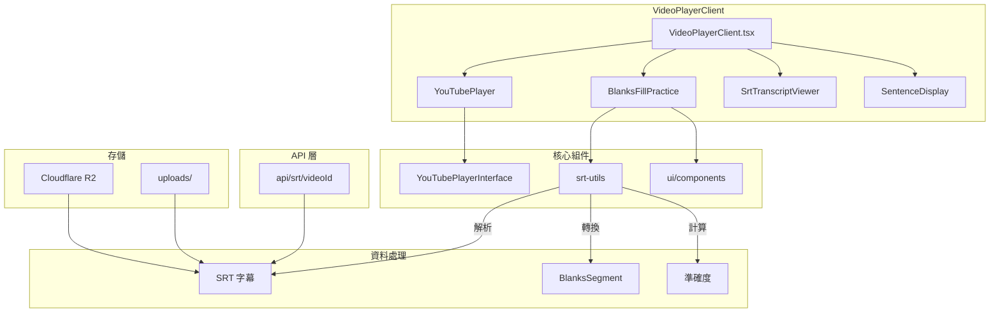
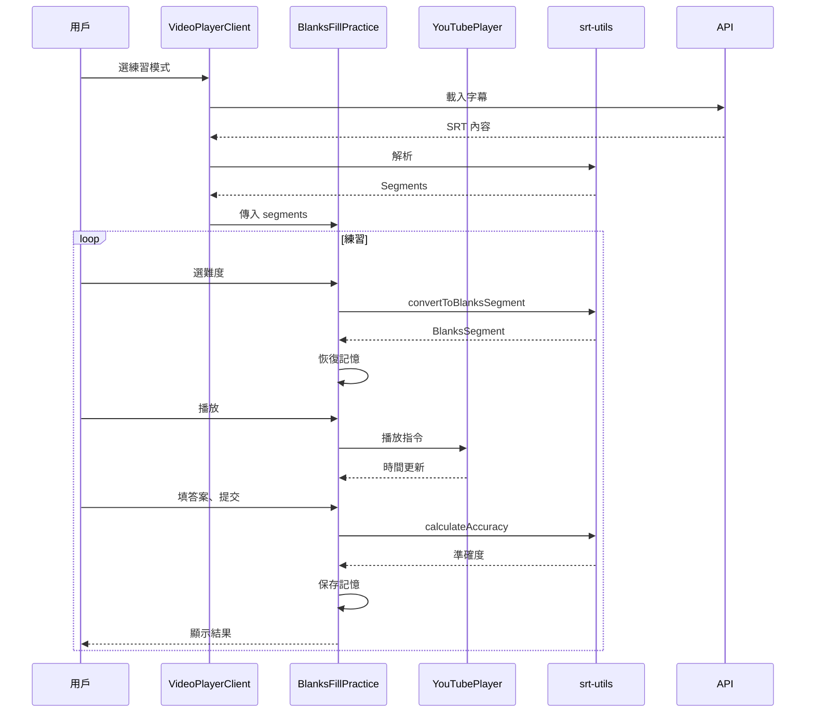
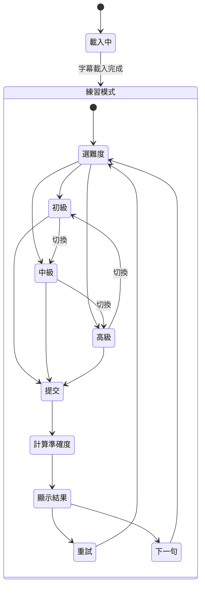
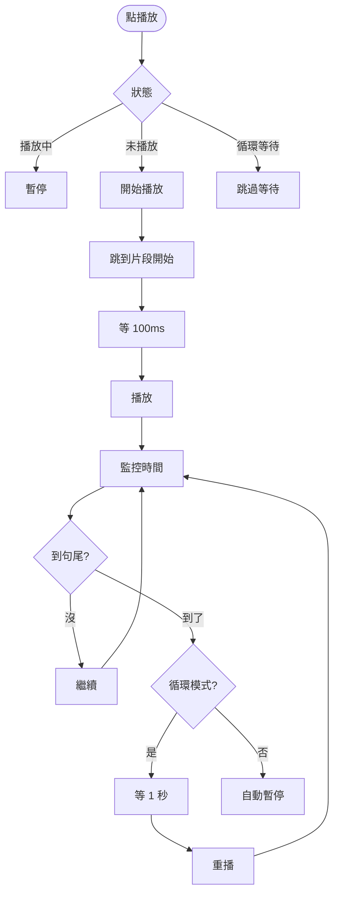
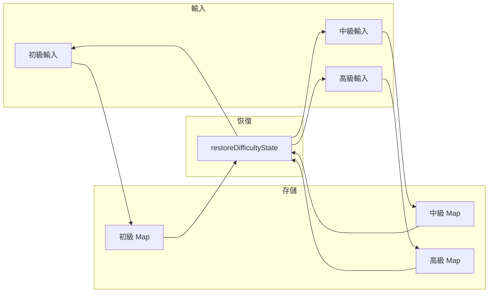
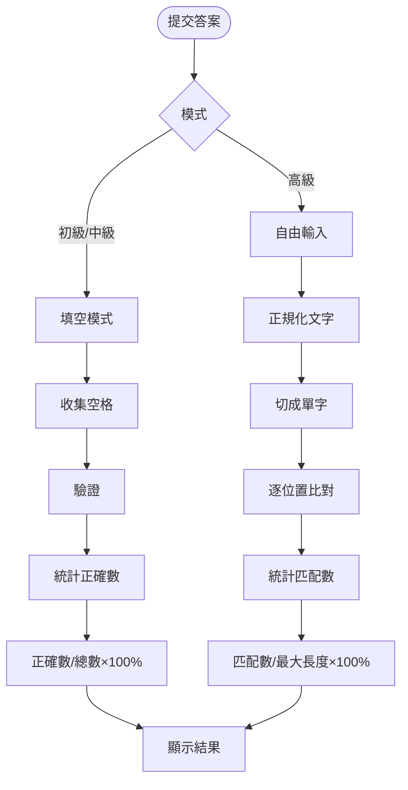
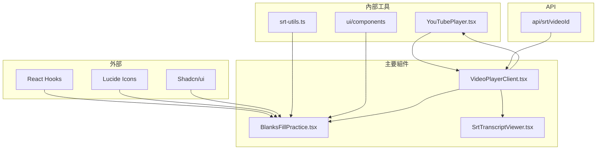

# 聽打練習系統架構

## 整體架構

```mermaid
graph TB
    subgraph "VideoPlayerClient"
        VPC[VideoPlayerClient.tsx]
        VPC --> YTP[YouTubePlayer]
        VPC --> BFP[BlanksFillPractice]
        VPC --> STV[SrtTranscriptViewer]
        VPC --> SD[SentenceDisplay]
    end

    subgraph "核心組件"
        YTP --> YPI[YouTubePlayerInterface]
        BFP --> SU[srt-utils]
        BFP --> UI["ui/components"]
    end

    subgraph "資料處理"
        SU --> |解析| SRT[SRT 字幕]
        SU --> |轉換| BS[BlanksSegment]
        SU --> |計算| ACC[準確度]
    end

    subgraph "API 層"
        API["api/srt/videoId"] --> SRT
    end

    subgraph "存儲"
        R2[Cloudflare R2] --> SRT
        LOCAL["uploads/"] --> SRT
    end
```

## 資料流

```mermaid
sequenceDiagram
    participant User as 用戶
    participant VPC as VideoPlayerClient
    participant BFP as BlanksFillPractice
    participant YTP as YouTubePlayer
    participant SU as srt-utils
    participant API as API

    User->>VPC: 選練習模式
    VPC->>API: 載入字幕
    API-->>VPC: SRT 內容
    VPC->>SU: 解析
    SU-->>VPC: Segments
    VPC->>BFP: 傳入 segments
    
    loop 練習
        User->>BFP: 選難度
        BFP->>SU: convertToBlanksSegment
        SU-->>BFP: BlanksSegment
        BFP->>BFP: 恢復記憶
        
        User->>BFP: 播放
        BFP->>YTP: 播放指令
        YTP-->>BFP: 時間更新
        
        User->>BFP: 填答案、提交
        BFP->>SU: calculateAccuracy
        SU-->>BFP: 準確度
        BFP->>BFP: 保存記憶
        BFP-->>User: 顯示結果
    end
```

## 狀態流程

```mermaid
stateDiagram-v2
    [*] --> 載入中
    載入中 --> 練習模式 : 字幕載入完成
    
    state 練習模式 {
        [*] --> 選難度
        選難度 --> 初級
        選難度 --> 中級
        選難度 --> 高級
        
        初級 --> 中級 : 切換
        中級 --> 高級 : 切換
        高級 --> 初級 : 切換
        
        初級 --> 提交
        中級 --> 提交
        高級 --> 提交
        
        提交 --> 計算準確度
        計算準確度 --> 顯示結果
        顯示結果 --> 重試
        顯示結果 --> 下一句
        重試 --> 選難度
        下一句 --> 選難度
    }
```

## 播放控制流程

```mermaid
flowchart TD
    START([點播放]) --> CHECK{狀態}
    CHECK -->|播放中| PAUSE[暫停]
    CHECK -->|未播放| PLAY[開始播放]
    CHECK -->|循環等待| SKIP[跳過等待]
    
    PLAY --> SEEK[跳到片段開始]
    SEEK --> DELAY[等 100ms]
    DELAY --> START_PLAY[播放]
    START_PLAY --> MONITOR[監控時間]
    
    MONITOR --> TIME_CHECK{到句尾?}
    TIME_CHECK -->|沒| CONTINUE[繼續]
    TIME_CHECK -->|到了| LOOP_CHECK{循環模式?}
    
    LOOP_CHECK -->|是| LOOP_WAIT[等 1 秒]
    LOOP_CHECK -->|否| AUTO_PAUSE[自動暫停]
    
    LOOP_WAIT --> REPLAY[重播]
    REPLAY --> MONITOR
    
    CONTINUE --> MONITOR
```

## 記憶系統

```mermaid
graph LR
    subgraph "輸入"
        UI1[初級輸入]
        UI2[中級輸入]
        UI3[高級輸入]
    end
    
    subgraph "存儲"
        MAP1[初級 Map]
        MAP2[中級 Map]
        MAP3[高級 Map]
    end
    
    subgraph "恢復"
        RESTORE[restoreDifficultyState]
    end
    
    UI1 --> MAP1
    UI2 --> MAP2
    UI3 --> MAP3
    
    MAP1 --> RESTORE
    MAP2 --> RESTORE
    MAP3 --> RESTORE
    
    RESTORE --> UI1
    RESTORE --> UI2
    RESTORE --> UI3
```

## 準確度計算

```mermaid
flowchart TD
    INPUT([提交答案]) --> MODE{模式}
    
    MODE -->|初級/中級| BLANK[填空模式]
    MODE -->|高級| FREE[自由輸入]
    
    BLANK --> COLLECT[收集空格]
    COLLECT --> VALIDATE[驗證]
    VALIDATE --> COUNT_B[統計正確數]
    COUNT_B --> CALC_B["正確數/總數×100%"]
    
    FREE --> NORMALIZE[正規化文字]
    NORMALIZE --> SPLIT[切成單字]
    SPLIT --> COMPARE[逐位置比對]
    COMPARE --> COUNT_F[統計匹配數]
    COUNT_F --> CALC_F["匹配數/最大長度×100%"]
    
    CALC_B --> DISPLAY[顯示結果]
    CALC_F --> DISPLAY
```

## 組件依賴

```mermaid
graph TD
    subgraph "外部"
        REACT[React Hooks]
        LUCIDE[Lucide Icons]
        SHADCN["Shadcn/ui"]
    end
    
    subgraph "內部工具"
        SRT_UTILS[srt-utils.ts]
        YOUTUBE_PLAYER[YouTubePlayer.tsx]
        UI_COMPONENTS["ui/components"]
    end
    
    subgraph "主要組件"
        VIDEO_CLIENT[VideoPlayerClient.tsx]
        BLANKS_PRACTICE[BlanksFillPractice.tsx]
        TRANSCRIPT_VIEWER[SrtTranscriptViewer.tsx]
    end
    
    subgraph "API"
        SRT_API["api/srt/videoId"]
    end
    
    REACT --> BLANKS_PRACTICE
    LUCIDE --> BLANKS_PRACTICE
    SHADCN --> BLANKS_PRACTICE
    
    SRT_UTILS --> BLANKS_PRACTICE
    YOUTUBE_PLAYER --> VIDEO_CLIENT
    UI_COMPONENTS --> BLANKS_PRACTICE
    
    VIDEO_CLIENT --> BLANKS_PRACTICE
    VIDEO_CLIENT --> TRANSCRIPT_VIEWER
    VIDEO_CLIENT --> YOUTUBE_PLAYER
    
    SRT_API --> VIDEO_CLIENT
```
