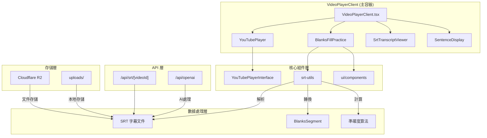
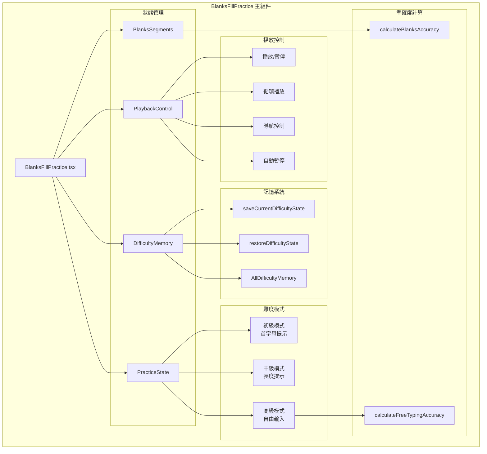
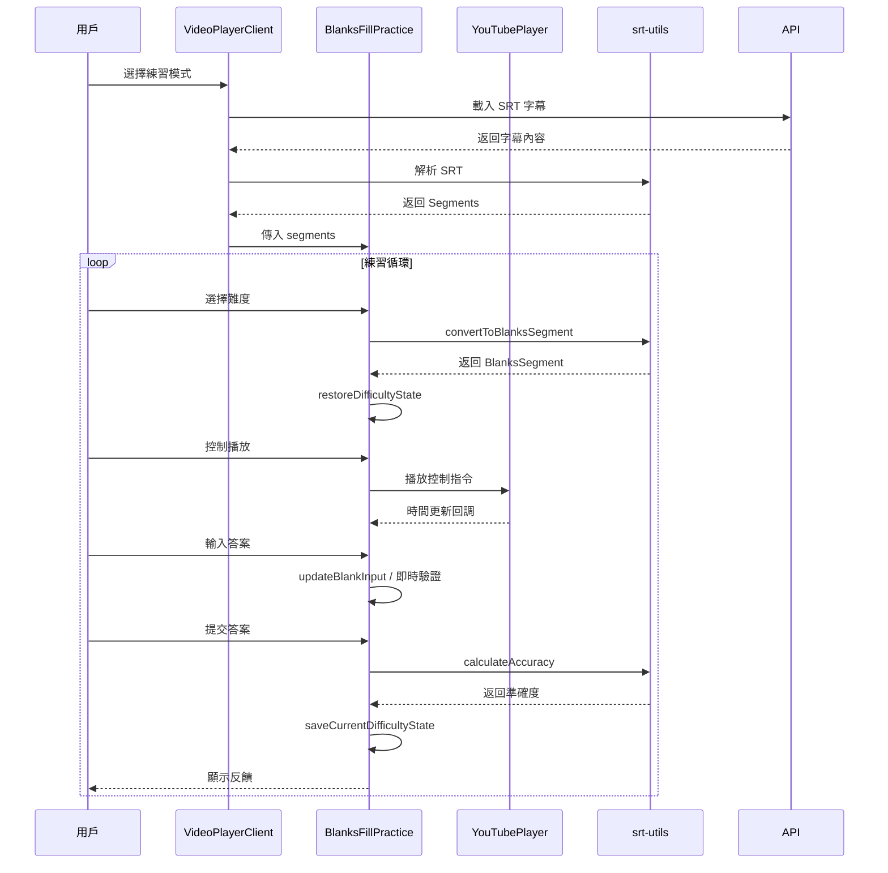
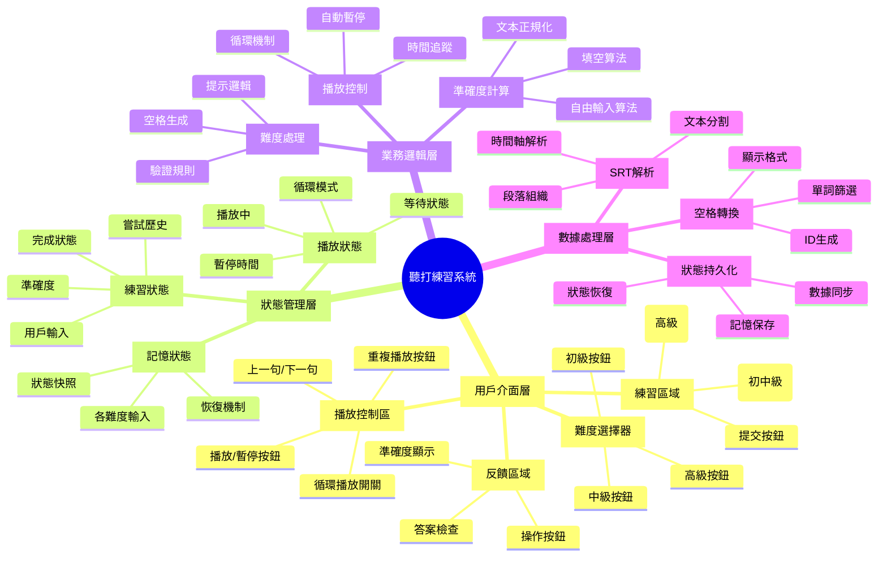
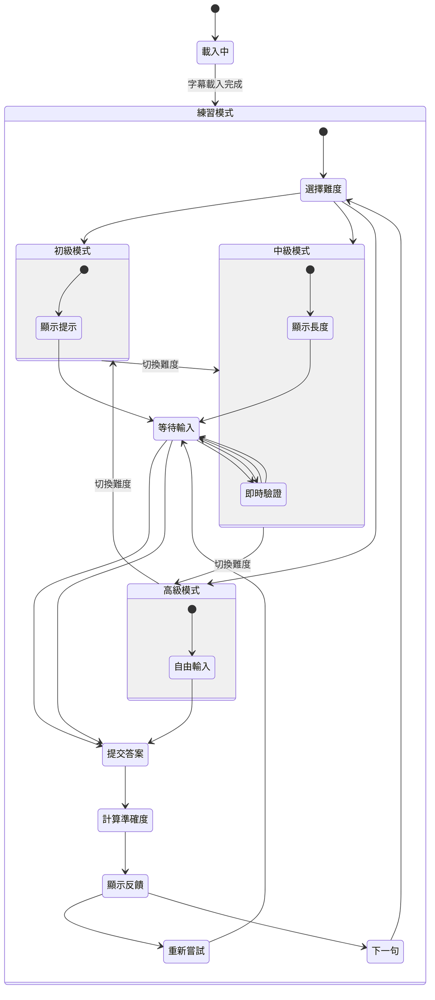
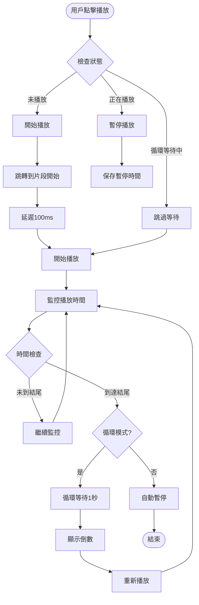
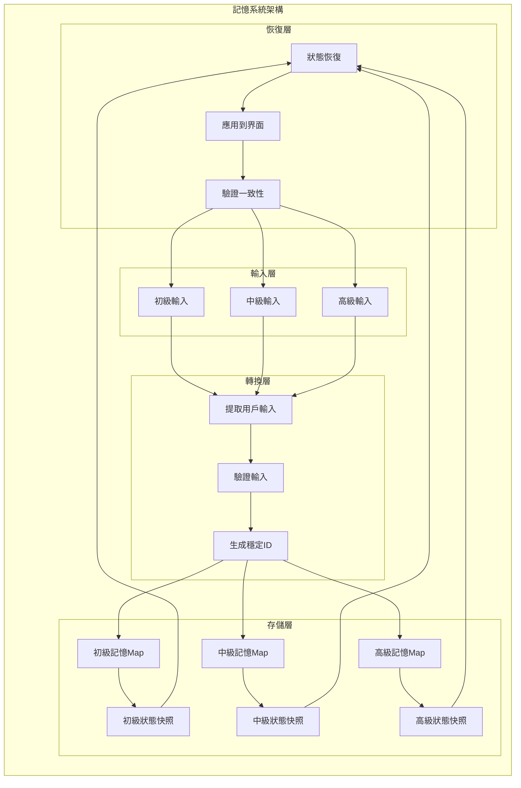
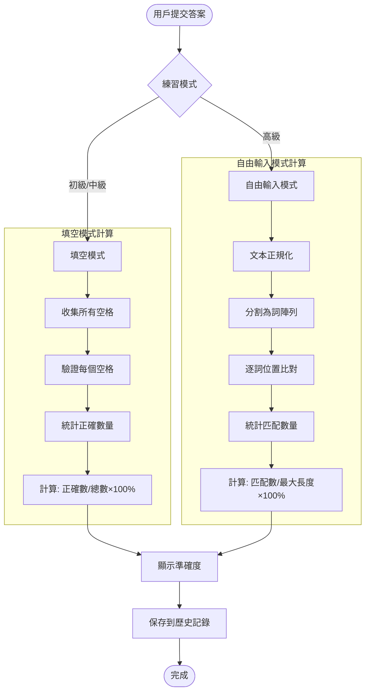

# 聽打練習系統架構圖

## 整體系統架構



## 聽打練習核心組件架構



## 數據流向圖



## 組件功能分解圖



## 狀態管理架構圖



## 播放控制流程圖



## 記憶系統架構圖



## 準確度計算流程圖



## 組件依賴關係圖

```mermaid
graph TD
    subgraph "外部依賴"
        REACT[React Hooks]
        LUCIDE[Lucide Icons]
        SHADCN[Shadcn/ui]
    end
    
    subgraph "內部工具"
        SRT_UTILS[srt-utils.ts]
        YOUTUBE_PLAYER[YouTubePlayer.tsx]
        UI_COMPONENTS[ui/components]
    end
    
    subgraph "主要組件"
        VIDEO_CLIENT[VideoPlayerClient.tsx]
        BLANKS_PRACTICE[BlanksFillPractice.tsx]
        TRANSCRIPT_VIEWER[SrtTranscriptViewer.tsx]
        SENTENCE_DISPLAY[SentenceDisplay.tsx]
    end
    
    subgraph "API 服務"
        SRT_API[/api/srt/[videoId]]
        OPENAI_API[/api/openai]
    end
    
    REACT --> BLANKS_PRACTICE
    LUCIDE --> BLANKS_PRACTICE
    SHADCN --> BLANKS_PRACTICE
    
    SRT_UTILS --> BLANKS_PRACTICE
    YOUTUBE_PLAYER --> VIDEO_CLIENT
    UI_COMPONENTS --> BLANKS_PRACTICE
    
    VIDEO_CLIENT --> BLANKS_PRACTICE
    VIDEO_CLIENT --> TRANSCRIPT_VIEWER
    VIDEO_CLIENT --> SENTENCE_DISPLAY
    VIDEO_CLIENT --> YOUTUBE_PLAYER
    
    SRT_API --> VIDEO_CLIENT
    OPENAI_API --> SRT_UTILS
```

## 總結

這個聽打練習系統展現了以下關鍵特性：

### 🏗️ **模組化設計**
- 清晰的組件分離和職責劃分
- 可重用的工具函數和UI組件
- 良好的依賴注入模式

### 🧠 **智能狀態管理**
- 跨難度的記憶保存機制
- 防競爭條件的狀態同步
- 完整的狀態生命週期管理

### 🎯 **用戶體驗優化**
- 三種漸進式難度設計
- 即時反饋和視覺提示
- 流暢的播放控制體驗

### ⚡ **性能考量**
- 優化的重新渲染策略
- 智能的狀態更新批處理
- 有效的資源清理機制

這個架構圖幫助開發者快速理解整個系統的結構和數據流向，便於維護和擴展功能。