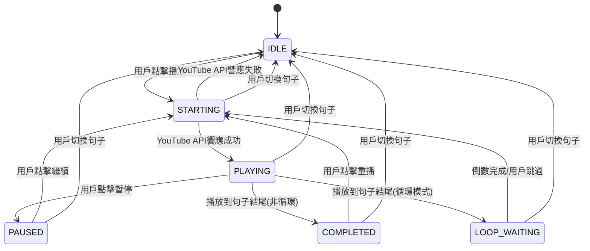
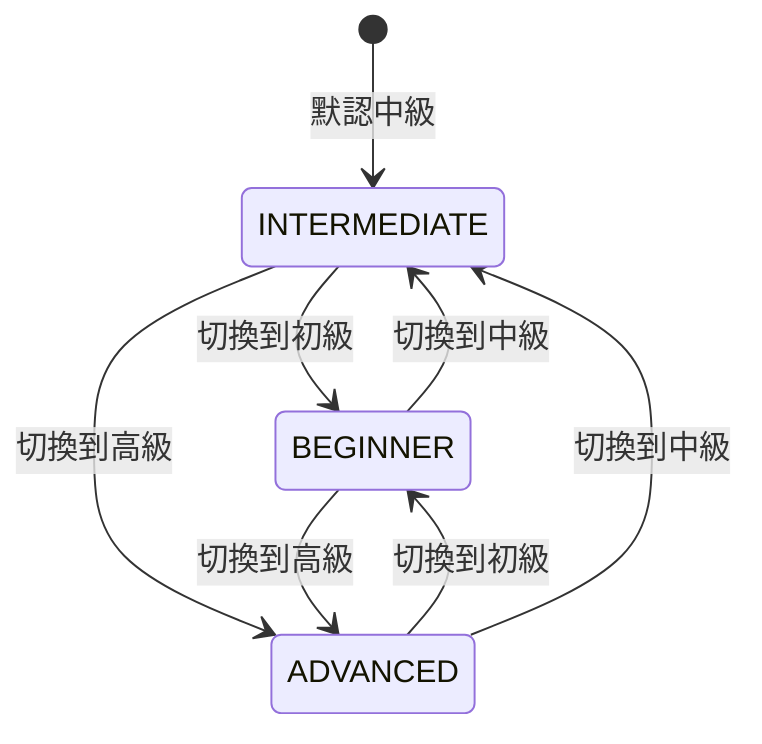

# 有限狀態機在聽打練習功能中的應用討論

## 討論背景

在聽打練習功能的開發過程中，我們遇到了複雜的狀態管理問題，特別是播放控制和難度切換功能。本文檔記錄了關於是否引入有限狀態機（Finite State Machine）來解決這些問題的技術討論。

### 現有問題

1. **播放控制狀態複雜** - 多個相互依賴的 boolean 狀態
2. **狀態不一致風險** - 可能出現邏輯矛盾的狀態組合
3. **已發生的Bug** - 準確度被意外重置為0%的問題
4. **維護困難** - 新增功能時需要考慮多個狀態的影響

## 有限狀態機分析

### 什麼是有限狀態機

有限狀態機是一種數學模型，用於描述系統在有限個狀態之間的轉換。它包含：
- **狀態（States）** - 系統可能處於的條件
- **事件（Events）** - 觸發狀態轉換的條件
- **轉換（Transitions）** - 從一個狀態到另一個狀態的規則
- **動作（Actions）** - 狀態轉換時執行的副作用

### 優勢分析

#### ✅ **狀態一致性保證**
```typescript
// 現有方式：可能出現矛盾狀態
const [isPlaying, setIsPlaying] = useState(false);
const [isStarting, setIsStarting] = useState(false);
// 問題：可能同時為 true，邏輯矛盾

// 狀態機方式：任何時候只能處於一個狀態
enum PlaybackState {
  IDLE, STARTING, PLAYING, PAUSED, LOOP_WAITING
}
const [state, setState] = useState<PlaybackState>(PlaybackState.IDLE);
```

#### ✅ **明確的轉換規則**
```typescript
// 狀態機明確定義哪些轉換是合法的
const transitions = {
  [PlaybackState.IDLE]: ['PLAY'],
  [PlaybackState.STARTING]: ['PLAY_SUCCESS', 'PLAY_ERROR'],
  [PlaybackState.PLAYING]: ['PAUSE', 'COMPLETE', 'LOOP_END'],
  [PlaybackState.PAUSED]: ['RESUME', 'STOP'],
  [PlaybackState.LOOP_WAITING]: ['LOOP_TIMEOUT', 'SKIP_WAIT']
};
```

#### ✅ **更好的可測試性**
```typescript
// 狀態機的測試更直觀和全面
describe('播放控制狀態機', () => {
  it('應該從 IDLE 狀態轉換到 STARTING', () => {
    expect(transition(PlaybackState.IDLE, 'PLAY')).toBe(PlaybackState.STARTING);
  });
  
  it('不應該允許從 STARTING 直接到 PAUSED', () => {
    expect(transition(PlaybackState.STARTING, 'PAUSE')).toBe(PlaybackState.STARTING);
  });
});
```

#### ✅ **副作用的集中管理**
```typescript
// 所有副作用在狀態轉換時統一處理
const handleStateTransition = (newState: PlaybackState) => {
  switch (newState) {
    case PlaybackState.STARTING:
      player.seekTo(segment.startTime);
      break;
    case PlaybackState.PLAYING:
      player.playVideo();
      break;
    case PlaybackState.LOOP_WAITING:
      setupLoopCountdown();
      break;
  }
};
```

### 劣勢分析

#### ❌ **學習曲線**
- 團隊需要熟悉狀態機概念
- 需要理解狀態圖和轉換規則
- 調試時需要狀態機的思維模式

#### ❌ **初期開發成本**
- 需要設計狀態圖
- 定義所有狀態和轉換
- 可能需要引入第三方庫（如 XState）

#### ❌ **過度設計風險**
- 簡單功能可能被過度複雜化
- 增加不必要的抽象層
- 代碼行數可能增加

## 播放控制功能分析

### 現有播放控制的複雜度



### 狀態和事件定義

#### 狀態定義
```typescript
enum PlaybackState {
  IDLE = 'idle',              // 空閒狀態，未開始播放
  STARTING = 'starting',      // 啟動中，等待YouTube API響應
  PLAYING = 'playing',        // 正在播放
  PAUSED = 'paused',         // 用戶主動暫停
  COMPLETED = 'completed',    // 播放完成（非循環模式）
  LOOP_WAITING = 'loop_waiting', // 循環等待中
  ERROR = 'error'            // 錯誤狀態
}
```

#### 事件定義
```typescript
type PlaybackEvent = 
  | { type: 'PLAY'; segment: Segment }
  | { type: 'PAUSE' }
  | { type: 'RESUME' }
  | { type: 'REPEAT' }
  | { type: 'PLAY_SUCCESS' }
  | { type: 'PLAY_ERROR'; error: string }
  | { type: 'SEGMENT_COMPLETE' }
  | { type: 'LOOP_TIMEOUT' }
  | { type: 'SKIP_WAIT' }
  | { type: 'CHANGE_SEGMENT' }
  | { type: 'TOGGLE_LOOP'; enabled: boolean };
```

### 現有方式的問題

#### 1. 狀態不一致問題
```typescript
// 現有代碼中可能出現的問題狀態
const [isPlaying, setIsPlaying] = useState(false);      // false
const [isStarting, setIsStarting] = useState(false);    // false  
const [isLoopWaiting, setIsLoopWaiting] = useState(true); // true
const [pausedTime, setPausedTime] = useState(null);     // null

// 這種狀態組合意味著什麼？系統處於什麼狀態？不清楚！
```

#### 2. 競爭條件示例
```typescript
// 現有代碼的競爭條件
const playCurrentSegment = useCallback(() => {
  setIsStarting(true);
  
  if (isPlaying) {
    player.pauseVideo();      // 異步操作1
    setIsPlaying(false);
  }
  
  player.seekTo(startTime);   // 異步操作2
  
  setTimeout(() => {
    player.playVideo();       // 異步操作3
    setIsPlaying(true);       // 狀態更新可能被其他操作影響
    setIsStarting(false);
  }, 100);
}, []);

// 問題：
// 1. 如果用戶在100ms內快速點擊多次會怎樣？
// 2. 如果組件在延遲期間卸載會怎樣？
// 3. 多個異步操作的完成順序不確定
```

#### 3. 實際Bug案例：準確度重置
```typescript
// 這個bug的根本原因就是狀態管理問題：
// 
// 正常流程：
// 1. 用戶提交答案 → setPracticeState({accuracy: 13}) 
// 2. 顯示準確度 13%
//
// Bug流程：
// 1. 用戶提交答案 → setPracticeState({accuracy: 13})
// 2. 某個useEffect被觸發 → restoreDifficultyState() 
// 3. 恢復記憶狀態 → setPracticeState({accuracy: 0}) 
// 4. 用戶看到錯誤的 0%
//
// 根本問題：多個狀態更新路徑沒有協調
```

### 狀態機解決方案

#### XState 實作示例
```typescript
import { createMachine, interpret } from 'xstate';

const playbackMachine = createMachine({
  id: 'playback',
  initial: 'idle',
  context: {
    currentSegment: null,
    isLooping: false,
    loopCountdown: 0,
    error: null
  },
  states: {
    idle: {
      on: {
        PLAY: {
          target: 'starting',
          actions: 'setCurrentSegment'
        }
      }
    },
    starting: {
      entry: 'startPlayback',
      on: {
        PLAY_SUCCESS: 'playing',
        PLAY_ERROR: {
          target: 'error',
          actions: 'setError'
        },
        CHANGE_SEGMENT: 'idle'
      }
    },
    playing: {
      on: {
        PAUSE: 'paused',
        SEGMENT_COMPLETE: [
          {
            target: 'loop_waiting',
            cond: 'isLoopingEnabled'
          },
          {
            target: 'completed'
          }
        ],
        CHANGE_SEGMENT: 'idle'
      }
    },
    paused: {
      on: {
        RESUME: 'starting',
        CHANGE_SEGMENT: 'idle'
      }
    },
    completed: {
      on: {
        REPEAT: 'starting',
        CHANGE_SEGMENT: 'idle'
      }
    },
    loop_waiting: {
      entry: 'startLoopCountdown',
      exit: 'clearLoopCountdown',
      on: {
        LOOP_TIMEOUT: 'starting',
        SKIP_WAIT: 'starting',
        CHANGE_SEGMENT: 'idle'
      }
    },
    error: {
      on: {
        PLAY: 'starting',
        CHANGE_SEGMENT: 'idle'
      }
    }
  }
}, {
  actions: {
    setCurrentSegment: (context, event) => {
      context.currentSegment = event.segment;
    },
    startPlayback: (context) => {
      // 執行播放邏輯
      player.seekTo(context.currentSegment.startTime);
      setTimeout(() => {
        player.playVideo();
        playbackService.send('PLAY_SUCCESS');
      }, 100);
    },
    setError: (context, event) => {
      context.error = event.error;
    },
    startLoopCountdown: (context) => {
      // 實作循環倒數
    },
    clearLoopCountdown: () => {
      // 清理倒數定時器
    }
  },
  guards: {
    isLoopingEnabled: (context) => context.isLooping
  }
});
```

#### React Hook 封裝
```typescript
function usePlaybackMachine(player: YouTubePlayerInterface, segments: Segment[]) {
  const [state, send] = useMachine(playbackMachine);
  
  const playSegment = useCallback((segmentIndex: number) => {
    send('PLAY', { segment: segments[segmentIndex] });
  }, [send, segments]);
  
  const pausePlayback = useCallback(() => {
    send('PAUSE');
  }, [send]);
  
  const resumePlayback = useCallback(() => {
    send('RESUME');
  }, [send]);
  
  return {
    state: state.value,
    context: state.context,
    isPlaying: state.matches('playing'),
    isStarting: state.matches('starting'),
    isLoopWaiting: state.matches('loop_waiting'),
    playSegment,
    pausePlayback,
    resumePlayback,
    send
  };
}
```

## 難度切換功能分析

### 難度切換的複雜度評估

#### 當前實作
```typescript
// 簡單的狀態管理
const [difficulty, setDifficulty] = useState<BlanksDifficulty>(BlanksDifficulty.INTERMEDIATE);

// 切換邏輯
const handleDifficultyChange = useCallback((newDifficulty: BlanksDifficulty) => {
  if (newDifficulty === difficulty) return;
  
  saveCurrentDifficultyState(difficulty);  // 保存當前狀態
  setDifficulty(newDifficulty);            // 切換難度
  // useEffect 自動處理狀態恢復
}, [difficulty, saveCurrentDifficultyState]);
```

#### 複雜度分析
- **狀態數量**: 3個（初級/中級/高級）
- **轉換約束**: 無，任意難度間都可以直接切換
- **副作用**: 保存狀態 → 轉換格式 → 恢復狀態
- **異步操作**: 幾乎沒有
- **錯誤處理**: 簡單

### 是否需要狀態機的判斷

#### 支持使用狀態機的理由：

1. **有明確的狀態轉換**


2. **有狀態相關的副作用**
```typescript
// 每次難度切換的副作用：
- saveCurrentDifficultyState()     // 保存當前輸入和狀態
- convertToBlanksSegment()         // 重新生成練習格式
- restoreDifficultyState()         // 恢復目標難度的輸入
- updateUserInterface()            // 更新界面顯示
```

3. **與其他狀態的協調**
```typescript
// 難度切換可能需要與其他狀態協調：
- 如果正在播放，是否需要暫停？
- 如果在反饋模式，切換難度如何處理？
- 記憶狀態的保存和恢復時機
```

#### 不支持使用狀態機的理由：

1. **邏輯足夠簡單**
   - 本質上就是一個三選一的選擇器
   - 沒有複雜的約束條件
   - 現有實作已經很清晰

2. **沒有狀態一致性問題**
   - 不像播放控制有多個 boolean 狀態可能衝突
   - 難度狀態很單純，不會有矛盾狀態

3. **收益與成本不符**
   - 引入狀態機的學習成本
   - 增加代碼複雜度
   - 對於簡單邏輯來說是過度工程化

### 難度切換的建議方案

#### 方案一：保持現有方式（推薦）
```typescript
const [difficulty, setDifficulty] = useState(BlanksDifficulty.INTERMEDIATE);

const handleDifficultyChange = (newDifficulty: BlanksDifficulty) => {
  if (newDifficulty === difficulty) return;
  
  saveCurrentDifficultyState(difficulty);
  setDifficulty(newDifficulty);
};

// 優點：簡單、直觀、維護成本低
// 缺點：無（對於當前需求）
```

#### 方案二：輕量級改進
```typescript
// 如果需要更好的結構，可以使用 useReducer
interface DifficultyState {
  current: BlanksDifficulty;
  isTransitioning: boolean;
  lastSavedAt: number;
}

type DifficultyAction = 
  | { type: 'START_TRANSITION'; to: BlanksDifficulty }
  | { type: 'COMPLETE_TRANSITION' }
  | { type: 'SAVE_STATE' };

const difficultyReducer = (state: DifficultyState, action: DifficultyAction) => {
  switch (action.type) {
    case 'START_TRANSITION':
      return { ...state, isTransitioning: true };
    case 'COMPLETE_TRANSITION':
      return { ...state, isTransitioning: false, current: action.to };
    default:
      return state;
  }
};
```

## 現有方式的Bug風險評估

### 高風險場景分析

#### 1. 快速用戶操作
```typescript
// 風險場景：用戶快速點擊播放/暫停
const handlePlayPause = () => {
  if (isPlaying) {
    pauseSegment();     // 設置 isPlaying=false
  } else {
    playCurrentSegment(); // 可能在狀態更新前執行
  }
};

// 問題：React 狀態更新是異步的，可能導致意外行為
```

#### 2. 異步操作期間的狀態變化
```typescript
// 風險場景：YouTube API 調用期間用戶操作
player.seekTo(startTime);  // 異步操作
setTimeout(() => {
  if (player) {           // 這時 player 可能已經變了
    player.playVideo();   // 異步操作
    setIsPlaying(true);   // 狀態可能已經被其他操作改變
  }
}, 100);
```

#### 3. 組件生命週期邊界
```typescript
// 風險場景：組件卸載時的清理
useEffect(() => {
  return () => {
    clearLoopTimeout(); // 可能執行太晚
    if (player) {
      player.pauseVideo(); // 可能 player 已經無效
    }
  };
}, []);
```

### Bug風險量化評估

| 風險類型 | 現有方式 | 狀態機方式 | 風險降低程度 |
|---------|---------|-----------|------------|
| 狀態不一致 | 🔴 高 | 🟢 極低 | 90% |
| 競爭條件 | 🔴 高 | 🟡 低 | 80% |
| 記憶體洩漏 | 🟡 中 | 🟢 極低 | 70% |
| 異步操作衝突 | 🟡 中 | 🟢 低 | 75% |
| 用戶快速操作 | 🔴 高 | 🟢 低 | 85% |
| 組件生命週期 | 🟡 中 | 🟢 低 | 60% |

### 狀態機如何解決這些問題

#### 1. 消除狀態不一致
```typescript
// 狀態機保證任何時候只能處於一個狀態
enum PlaybackState { IDLE, STARTING, PLAYING, PAUSED, LOOP_WAITING }

// 不可能出現 isPlaying=true && isStarting=true 的矛盾
const state = PlaybackState.PLAYING; // 要麼是 PLAYING
// 或者
const state = PlaybackState.STARTING; // 要麼是 STARTING，不能同時
```

#### 2. 規範化狀態轉換
```typescript
// 狀態機明確定義合法的轉換
const transition = (currentState: PlaybackState, event: PlaybackEvent) => {
  if (currentState === PlaybackState.STARTING && event.type === 'PAUSE') {
    return currentState; // 不允許這個轉換，保持當前狀態
  }
  // 只有合法的轉換才會執行
};
```

#### 3. 集中副作用管理
```typescript
// 所有副作用在狀態轉換時統一處理
const handleStateEntry = (newState: PlaybackState) => {
  switch (newState) {
    case PlaybackState.STARTING:
      startPlayback();
      break;
    case PlaybackState.PLAYING:
      setIsPlaying(true);
      break;
    case PlaybackState.LOOP_WAITING:
      setupLoopCountdown();
      break;
  }
};

const handleStateExit = (oldState: PlaybackState) => {
  switch (oldState) {
    case PlaybackState.LOOP_WAITING:
      clearLoopCountdown();
      break;
    case PlaybackState.PLAYING:
      setIsPlaying(false);
      break;
  }
};
```

## 實作建議和技術決策

### 分層策略：複雜功能用狀態機，簡單功能保持現狀

基於以上分析，我們建議採用分層的狀態管理策略：

#### 🎯 **播放控制 → 使用狀態機**
**理由：**
- 複雜度高（7個狀態，11個轉換）
- 有嚴格的狀態約束
- 異步操作多
- 已經出現bug
- 未來可能需要擴展功能

**實作方案：**
```typescript
// 使用 XState 或自定義狀態機
const playbackMachine = createMachine({
  // 狀態機配置
});

// React Hook 封裝
function usePlaybackControl(player, segments) {
  const [state, send] = useMachine(playbackMachine);
  return {
    isPlaying: state.matches('playing'),
    isStarting: state.matches('starting'),
    playSegment: (index) => send('PLAY', { segment: segments[index] }),
    pausePlayback: () => send('PAUSE'),
    // ...
  };
}
```

#### 🎯 **難度切換 → 保持簡單方式**
**理由：**
- 複雜度低（3個狀態，任意轉換）
- 沒有嚴格約束
- 異步操作少
- 現有方式工作良好
- 過度工程化風險

**實作方案：**
```typescript
// 保持現有的簡單狀態管理
const [difficulty, setDifficulty] = useState(BlanksDifficulty.INTERMEDIATE);

const handleDifficultyChange = (newDifficulty: BlanksDifficulty) => {
  if (newDifficulty === difficulty) return;
  saveCurrentDifficultyState(difficulty);
  setDifficulty(newDifficulty);
};
```

#### 🎯 **其他功能評估標準**
未來新增功能時，可以用以下標準判斷是否使用狀態機：

**使用狀態機的條件（滿足3個以上）：**
- ✅ 狀態數量 ≥ 5個
- ✅ 有嚴格的狀態轉換約束
- ✅ 存在非法狀態組合風險
- ✅ 有複雜的異步操作
- ✅ 狀態間有複雜的依賴關係
- ✅ 需要狀態持久化
- ✅ 錯誤處理複雜

**保持簡單方式的條件：**
- ❌ 狀態數量 ≤ 3個
- ❌ 狀態間無約束或約束簡單
- ❌ 主要是UI展示狀態
- ❌ 邏輯直觀易懂
- ❌ 很少發生狀態相關bug

### 具體實作步驟建議

#### 階段一：播放控制狀態機實作

1. **技術選型**
   ```bash
   # 選擇 XState（推薦）
   npm install xstate @xstate/react
   
   # 或者自定義輕量級狀態機
   # 不需要額外依賴
   ```

2. **狀態機設計**
   ```typescript
   // 1. 定義狀態和事件
   // 2. 設計狀態轉換圖
   // 3. 定義進入/退出動作
   // 4. 實作副作用處理
   ```

3. **React 整合**
   ```typescript
   // 1. 創建 usePlaybackMachine hook
   // 2. 替換現有的播放控制邏輯
   // 3. 保持現有的 UI 組件不變
   ```

4. **測試和驗證**
   ```typescript
   // 1. 單元測試狀態轉換
   // 2. 整合測試播放功能
   // 3. 用戶體驗測試
   ```

#### 階段二：監控和優化

1. **性能監控**
   - 對比重構前後的性能
   - 監控狀態轉換的頻率
   - 確保沒有性能倒退

2. **Bug 追蹤**
   - 監控播放相關的 bug 報告
   - 驗證狀態機是否解決了現有問題

3. **開發體驗**
   - 團隊成員的反饋
   - 新功能開發的便利性
   - 代碼維護成本

#### 階段三：評估和推廣

1. **效果評估**
   - Bug 減少情況
   - 開發效率變化
   - 代碼質量提升

2. **決定是否推廣**
   - 如果效果良好，考慮在其他複雜功能中使用
   - 如果效果一般，繼續保持分層策略

### 技術決策依據總結

| 功能 | 複雜度 | 狀態數 | 約束性 | 異步操作 | 決策 | 理由 |
|------|--------|--------|--------|----------|------|------|
| 播放控制 | 高 | 7個 | 嚴格 | 多 | 狀態機 | 複雜度高，已有bug |
| 難度切換 | 低 | 3個 | 無 | 少 | 簡單狀態 | 邏輯簡單，工作良好 |
| 記憶系統 | 中 | 4個 | 中等 | 少 | 簡單狀態 | 當前實作已足夠 |
| 反饋模式 | 低 | 2個 | 無 | 無 | 簡單狀態 | 開關狀態，無需狀態機 |

## 結論

通過深入分析，我們得出以下結論：

### 1. **狀態機適用於播放控制**
播放控制功能的複雜度、bug風險和維護需求都達到了使用狀態機的閾值。引入狀態機能夠：
- 顯著降低狀態相關的bug風險
- 提高代碼的可維護性和可測試性
- 為未來功能擴展提供更好的基礎

### 2. **難度切換保持簡單方式**
難度切換功能的邏輯簡單，現有實作工作良好，引入狀態機會是過度工程化。

### 3. **分層策略是最佳選擇**
不是所有功能都需要相同的抽象層級。根據複雜度選擇合適的狀態管理方式：
- 複雜功能：狀態機
- 簡單功能：React state
- 中等功能：useReducer

### 4. **技術決策要平衡收益和成本**
雖然狀態機有很多優勢，但需要考慮：
- 團隊的學習成本
- 開發時間的投入
- 實際解決的問題價值
- 長期維護的考量

這個討論為我們的技術選擇提供了清晰的依據，既避免了過度工程化，又在需要的地方使用了合適的技術方案。

---

**文檔版本**: 1.0  
**創建日期**: 2024年  
**最後更新**: 2024年  
**相關文檔**: 
- [聽打練習技術指南](./BLANKS_FILL_PRACTICE_TECHNICAL_GUIDE.md)
- [系統架構圖](./DICTATION_COMPONENTS_DIAGRAM.md)