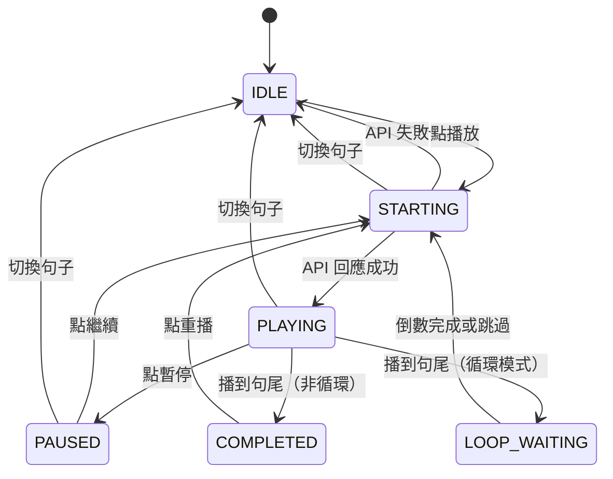

# 播放控制的狀態管理討論

開發聽打練習功能時，播放控制的狀態管理變得很複雜。這份文檔記錄了我們討論要不要用狀態機（FSM）來解決這些問題。

## 遇到的問題

1. 播放控制有很多互相依賴的 boolean 狀態
2. 可能出現邏輯矛盾的狀態組合
3. 實際發生過 bug：準確度被意外重置成 0%
4. 加新功能時要考慮的狀態太多

## 狀態機是什麼

簡單說就是：
- 系統在任何時候只能處於一個狀態
- 只有特定事件才能觸發狀態轉換
- 轉換時可以執行副作用

## 播放控制的狀態圖



## 現有方式的問題

### 狀態不一致

```typescript
const [isPlaying, setIsPlaying] = useState(false);
const [isStarting, setIsStarting] = useState(false);
const [isLoopWaiting, setIsLoopWaiting] = useState(true);

// 這組合是什麼意思？不清楚
```

### 競爭條件

```typescript
const playCurrentSegment = useCallback(() => {
  setIsStarting(true);
  
  if (isPlaying) {
    player.pauseVideo();  // 異步
    setIsPlaying(false);
  }
  
  player.seekTo(startTime);  // 異步
  
  setTimeout(() => {
    player.playVideo();  // 異步
    setIsPlaying(true);  // 可能被其他操作影響
    setIsStarting(false);
  }, 100);
}, []);

// 用戶快速點擊多次會怎樣？
// 組件在 100ms 內卸載會怎樣？
```

### 實際 bug

```
正常流程：
1. 提交答案 → setPracticeState({accuracy: 13})
2. 顯示 13%

Bug 流程：
1. 提交答案 → setPracticeState({accuracy: 13})
2. 某個 useEffect 觸發 → restoreDifficultyState()
3. 恢復記憶 → setPracticeState({accuracy: 0})
4. 顯示 0%（錯的）
```

## 狀態機的好處

### 狀態一致性

```typescript
enum PlaybackState {
  IDLE, STARTING, PLAYING, PAUSED, LOOP_WAITING
}

// 任何時候只能是其中一個，不會矛盾
const [state, setState] = useState(PlaybackState.IDLE);
```

### 明確的轉換規則

```typescript
const transitions = {
  [PlaybackState.IDLE]: ['PLAY'],
  [PlaybackState.STARTING]: ['PLAY_SUCCESS', 'PLAY_ERROR'],
  [PlaybackState.PLAYING]: ['PAUSE', 'COMPLETE', 'LOOP_END'],
  // ...
};
```

### 好測試

```typescript
it('從 IDLE 轉到 STARTING', () => {
  expect(transition(PlaybackState.IDLE, 'PLAY')).toBe(PlaybackState.STARTING);
});

it('不能從 STARTING 直接到 PAUSED', () => {
  expect(transition(PlaybackState.STARTING, 'PAUSE')).toBe(PlaybackState.STARTING);
});
```

## 狀態機的壞處

- 學習成本
- 初期開發時間
- 簡單功能可能過度設計

## 最終決定

### 播放控制：用 FSM 概念，但不用 XState

播放控制夠複雜，值得用狀態機思維。但我們選擇手動實作而不是引入 XState：

```typescript
// 用多個 boolean 組合代表狀態
const [isPlaying, setIsPlaying] = useState(false);
const [isStarting, setIsStarting] = useState(false);
const [pausedTime, setPausedTime] = useState<number | null>(null);
const [isLooping, setIsLooping] = useState(false);
const [isLoopWaiting, setIsLoopWaiting] = useState(false);

// 狀態組合對應 FSM 狀態：
// IDLE: !isPlaying && !isStarting && !isLoopWaiting
// STARTING: isStarting
// PLAYING: isPlaying && !isLoopWaiting
// PAUSED: pausedTime !== null
// LOOP_WAITING: isLoopWaiting
```

為什麼不用 XState？
- 團隊對 React Hooks 比較熟
- 不想引入新依賴
- 手動實作已經能保證狀態一致性（用守衛條件）

### 難度切換：保持簡單

難度切換就三個狀態，沒有複雜約束，用 useState 就夠了：

```typescript
const [difficulty, setDifficulty] = useState(BlanksDifficulty.INTERMEDIATE);
```

## 判斷標準

什麼時候該用狀態機？滿足 3 個以上就考慮：
- 狀態數量 ≥ 5
- 有嚴格的轉換約束
- 可能出現非法狀態組合
- 有複雜的異步操作
- 狀態間有複雜依賴

什麼時候不用？
- 狀態數量 ≤ 3
- 沒什麼約束
- 主要是 UI 展示狀態
- 邏輯很直觀

---

結論：用 FSM **概念**而不是 FSM **庫**。在需要的地方用狀態機思維設計，但不一定要引入額外依賴。
