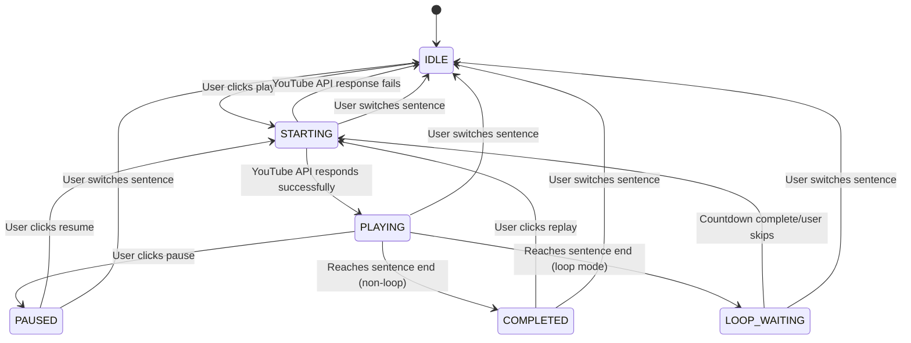

# Finite State Machine Application in Dictation Practice

## Discussion Background

During the development of the dictation practice feature, we encountered complex state management challenges, particularly in playback control and difficulty switching. This document records the technical discussion on whether to introduce a Finite State Machine (FSM) to address these issues.

### Existing Problems

1. **Complex Playback Control States** - Multiple interdependent boolean states
2. **State Inconsistency Risk** - Potential for logically contradictory state combinations
3. **Actual Bugs Occurred** - Issue where accuracy was unexpectedly reset to 0%
4. **Maintenance Difficulty** - Need to consider multiple state impacts when adding features

## Finite State Machine Analysis

### What is a Finite State Machine

A Finite State Machine is a mathematical model used to describe system transitions between a finite number of states. It includes:
- **States** - Conditions the system can be in
- **Events** - Conditions that trigger state transitions
- **Transitions** - Rules for moving from one state to another
- **Actions** - Side effects executed during state transitions

### Advantages Analysis

#### ✅ **State Consistency Guarantee**
```typescript
// Current approach: Possible contradictory states
const [isPlaying, setIsPlaying] = useState(false);
const [isStarting, setIsStarting] = useState(false);
// Problem: Both could be true, causing logical contradiction

// State machine approach: Can only be in one state at any time
enum PlaybackState {
  IDLE, STARTING, PLAYING, PAUSED, LOOP_WAITING
}
const [state, setState] = useState<PlaybackState>(PlaybackState.IDLE);
```

#### ✅ **Explicit Transition Rules**
```typescript
// State machine explicitly defines legal transitions
const transitions = {
  [PlaybackState.IDLE]: ['PLAY'],
  [PlaybackState.STARTING]: ['PLAY_SUCCESS', 'PLAY_ERROR'],
  [PlaybackState.PLAYING]: ['PAUSE', 'COMPLETE', 'LOOP_END'],
  [PlaybackState.PAUSED]: ['RESUME', 'STOP'],
  [PlaybackState.LOOP_WAITING]: ['LOOP_TIMEOUT', 'SKIP_WAIT']
};
```

#### ✅ **Better Testability**
```typescript
// State machine testing is more intuitive and comprehensive
describe('Playback Control State Machine', () => {
  it('should transition from IDLE to STARTING', () => {
    expect(transition(PlaybackState.IDLE, 'PLAY')).toBe(PlaybackState.STARTING);
  });
  
  it('should not allow direct transition from STARTING to PAUSED', () => {
    expect(transition(PlaybackState.STARTING, 'PAUSE')).toBe(PlaybackState.STARTING);
  });
});
```

#### ✅ **Centralized Side Effect Management**
```typescript
// All side effects are handled uniformly during state transitions
const handleStateTransition = (newState: PlaybackState) => {
  switch (newState) {
    case PlaybackState.STARTING:
      player.seekTo(segment.startTime);
      break;
    case PlaybackState.PLAYING:
      player.playVideo();
      break;
    case PlaybackState.LOOP_WAITING:
      setupLoopCountdown();
      break;
  }
};
```

### Disadvantages Analysis

#### ❌ **Learning Curve**
- Team needs to familiarize with state machine concepts
- Need to understand state diagrams and transition rules
- Requires state machine thinking for debugging

#### ❌ **Initial Development Cost**
- Need to design state diagrams
- Define all states and transitions
- May require third-party library (e.g., XState)

#### ❌ **Over-Engineering Risk**
- Simple features might become overly complex
- Introduces unnecessary abstraction layers
- Code lines may increase

## Playback Control Feature Analysis

### Current Playback Control Complexity



### State and Event Definitions

#### State Definition
```typescript
enum PlaybackState {
  IDLE = 'idle',              // Idle state, not started
  STARTING = 'starting',      // Starting, waiting for YouTube API response
  PLAYING = 'playing',        // Currently playing
  PAUSED = 'paused',         // User actively paused
  COMPLETED = 'completed',    // Playback complete (non-loop mode)
  LOOP_WAITING = 'loop_waiting', // Loop waiting
  ERROR = 'error'            // Error state
}
```

#### Event Definition
```typescript
type PlaybackEvent = 
  | { type: 'PLAY'; segment: Segment }
  | { type: 'PAUSE' }
  | { type: 'RESUME' }
  | { type: 'REPEAT' }
  | { type: 'PLAY_SUCCESS' }
  | { type: 'PLAY_ERROR'; error: string }
  | { type: 'SEGMENT_COMPLETE' }
  | { type: 'LOOP_TIMEOUT' }
  | { type: 'SKIP_WAIT' }
  | { type: 'CHANGE_SEGMENT' }
  | { type: 'TOGGLE_LOOP'; enabled: boolean };
```

### Problems with Current Approach

#### 1. State Inconsistency Issues
```typescript
// Problematic state combinations that might occur in current code
const [isPlaying, setIsPlaying] = useState(false);      // false
const [isStarting, setIsStarting] = useState(false);    // false  
const [isLoopWaiting, setIsLoopWaiting] = useState(true); // true
const [pausedTime, setPausedTime] = useState(null);     // null

// What does this state combination mean? What state is the system in? Unclear!
```

#### 2. Race Condition Example
```typescript
// Race conditions in current code
const playCurrentSegment = useCallback(() => {
  setIsStarting(true);
  
  if (isPlaying) {
    player.pauseVideo();      // Async operation 1
    setIsPlaying(false);
  }
  
  player.seekTo(startTime);   // Async operation 2
  
  setTimeout(() => {
    player.playVideo();       // Async operation 3
    setIsPlaying(true);       // State update might be affected by other operations
    setIsStarting(false);
  }, 100);
}, []);

// Problems:
// 1. What if user rapidly clicks multiple times within 100ms?
// 2. What if component unmounts during delay?
// 3. Uncertain completion order of multiple async operations
```

#### 3. Actual Bug Case: Accuracy Reset
```typescript
// The root cause of this bug is the state management problem:
// 
// Normal flow:
// 1. User submits answer → setPracticeState({accuracy: 13}) 
// 2. Display 13% accuracy
//
// Bug flow:
// 1. User submits answer → setPracticeState({accuracy: 13})
// 2. Some useEffect is triggered → restoreDifficultyState() 
// 3. Restore memory state → setPracticeState({accuracy: 0}) 
// 4. User sees incorrect 0%
//
// Root problem: Multiple state update paths without coordination
```

## Conclusion and Final Implementation

Through in-depth analysis, we reached the following conclusions:

### 1. **Playback Control Adopts FSM Concepts, But Without XState**
The complexity, bug risk, and maintenance requirements of playback control all reached the threshold for using state machines.

**Final Implementation: Manually Implemented Implicit State Machine**
```typescript
// Use multiple boolean states to represent system states
const [isPlaying, setIsPlaying] = useState(false);
const [isStarting, setIsStarting] = useState(false);
const [pausedTime, setPausedTime] = useState<number | null>(null);
const [isLooping, setIsLooping] = useState(false);
const [isLoopWaiting, setIsLoopWaiting] = useState(false);

// State combinations correspond to FSM states:
// IDLE: !isPlaying && !isStarting && !isLoopWaiting
// STARTING: isStarting
// PLAYING: isPlaying && !isLoopWaiting
// PAUSED: pausedTime !== null
// LOOP_WAITING: isLoopWaiting
```

**Why Not Use XState?**
- ✅ Avoid learning cost of introducing new dependencies
- ✅ Team more familiar with React Hooks
- ✅ Manual implementation already ensures state consistency (through guard conditions)
- ✅ Code more intuitive, suitable for small-medium teams to maintain

**Embodiment of FSM Principles:**
- ✅ Clear state definitions (through boolean combinations)
- ✅ Controlled state transitions (`if (!isStarting)` and other guard conditions)
- ✅ Centralized side effect management (`playCurrentSegment`, `pauseSegment`, etc.)
- ✅ Prevention of illegal state transitions

### 2. **Difficulty Switching Maintains Simple Approach**
Difficulty switching logic is simple, current implementation works well, introducing state machine would be over-engineering.

```typescript
// Simple useState is sufficient
const [difficulty, setDifficulty] = useState(BlanksDifficulty.INTERMEDIATE);
```

### 3. **Layered Strategy is the Best Choice**
Not all features need the same abstraction level. Choose appropriate state management based on complexity:
- Complex features: Manually implemented FSM (playback control)
- Simple features: React useState (difficulty switching)
- Medium features: useReducer (if needed)

### 4. **Technical Decisions Must Balance Benefits and Costs**
While state machine libraries like XState have many advantages, we must consider:
- Team learning cost
- Development time investment
- Actual problem-solving value
- Long-term maintenance considerations

**Our Choice**: Adopt FSM **concepts** rather than FSM **libraries**, ensuring state consistency while reducing learning costs and dependency complexity.

This discussion provided clear basis for our technical choices, avoiding over-engineering while using appropriate technical solutions where needed.

---

**Document Version**: 1.1  
**Created**: 2024  
**Last Updated**: January 2026  
**Implementation Status**: ✅ Completed (Manually implemented FSM, XState not used)  
**Related Documents**: 
- [Dictation Practice Technical Guide](./BLANKS_FILL_PRACTICE_TECHNICAL_GUIDE.md)
- [System Architecture Diagram](./DICTATION_COMPONENTS_DIAGRAM.md)
