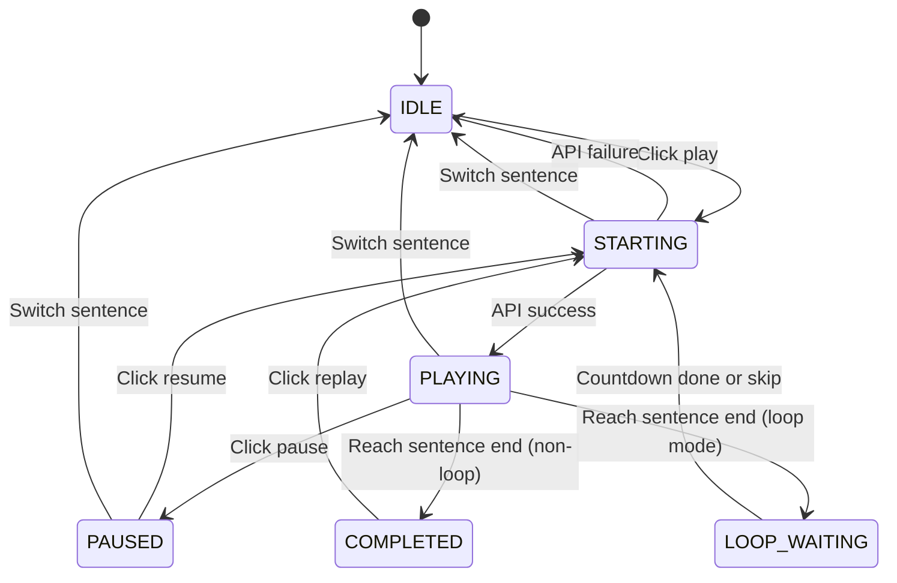

# Playback Control State Management Discussion

When developing the dictation practice feature, playback control state management got complicated. This doc records our discussion on whether to use a state machine (FSM) to solve these problems.

## Problems We Had

1. Playback control has many interdependent boolean states
2. Possible logically contradictory state combinations
3. Actual bug: accuracy unexpectedly reset to 0%
4. Too many states to consider when adding features

## What's a State Machine

Simply put:
- System can only be in one state at any time
- Only specific events can trigger state transitions
- Side effects can be executed during transitions

## Playback Control State Diagram



## Problems with Current Approach

### State Inconsistency

```typescript
const [isPlaying, setIsPlaying] = useState(false);
const [isStarting, setIsStarting] = useState(false);
const [isLoopWaiting, setIsLoopWaiting] = useState(true);

// What does this combination mean? Unclear
```

### Race Conditions

```typescript
const playCurrentSegment = useCallback(() => {
  setIsStarting(true);
  
  if (isPlaying) {
    player.pauseVideo();  // async
    setIsPlaying(false);
  }
  
  player.seekTo(startTime);  // async
  
  setTimeout(() => {
    player.playVideo();  // async
    setIsPlaying(true);  // might be affected by other operations
    setIsStarting(false);
  }, 100);
}, []);

// What if user clicks rapidly multiple times?
// What if component unmounts within 100ms?
```

### Actual Bug

```
Normal flow:
1. Submit answer -> setPracticeState({accuracy: 13})
2. Display 13%

Bug flow:
1. Submit answer -> setPracticeState({accuracy: 13})
2. Some useEffect triggers -> restoreDifficultyState()
3. Restore memory -> setPracticeState({accuracy: 0})
4. Display 0% (wrong)
```

## Benefits of State Machine

### State Consistency

```typescript
enum PlaybackState {
  IDLE, STARTING, PLAYING, PAUSED, LOOP_WAITING
}

// Can only be one of these at any time, no contradiction
const [state, setState] = useState(PlaybackState.IDLE);
```

### Explicit Transition Rules

```typescript
const transitions = {
  [PlaybackState.IDLE]: ['PLAY'],
  [PlaybackState.STARTING]: ['PLAY_SUCCESS', 'PLAY_ERROR'],
  [PlaybackState.PLAYING]: ['PAUSE', 'COMPLETE', 'LOOP_END'],
  // ...
};
```

### Easy to Test

```typescript
it('transitions from IDLE to STARTING', () => {
  expect(transition(PlaybackState.IDLE, 'PLAY')).toBe(PlaybackState.STARTING);
});

it('cannot go directly from STARTING to PAUSED', () => {
  expect(transition(PlaybackState.STARTING, 'PAUSE')).toBe(PlaybackState.STARTING);
});
```

## Downsides of State Machine

- Learning curve
- Initial development time
- Might be over-engineering for simple features

## Final Decision

### Playback Control: Use FSM Concepts, But Not XState

Playback control is complex enough to warrant state machine thinking. But we chose manual implementation over XState:

```typescript
// Multiple booleans combined to represent state
const [isPlaying, setIsPlaying] = useState(false);
const [isStarting, setIsStarting] = useState(false);
const [pausedTime, setPausedTime] = useState<number | null>(null);
const [isLooping, setIsLooping] = useState(false);
const [isLoopWaiting, setIsLoopWaiting] = useState(false);

// State combinations map to FSM states:
// IDLE: !isPlaying && !isStarting && !isLoopWaiting
// STARTING: isStarting
// PLAYING: isPlaying && !isLoopWaiting
// PAUSED: pausedTime !== null
// LOOP_WAITING: isLoopWaiting
```

Why not XState?
- Team more familiar with React Hooks
- Don't want to add new dependency
- Manual implementation already ensures state consistency (using guard conditions)

### Difficulty Switching: Keep It Simple

Difficulty switching has just 3 states, no complex constraints, useState is enough:

```typescript
const [difficulty, setDifficulty] = useState(BlanksDifficulty.INTERMEDIATE);
```

## Decision Criteria

When to use state machine? Consider if 3+ apply:
- State count >= 5
- Strict transition constraints
- Possible illegal state combinations
- Complex async operations
- Complex dependencies between states

When not to use?
- State count <= 3
- Few constraints
- Mainly UI display states
- Logic is straightforward

---

Conclusion: Use FSM **concepts** rather than FSM **libraries**. Design with state machine thinking where needed, but don't necessarily add extra dependencies.
